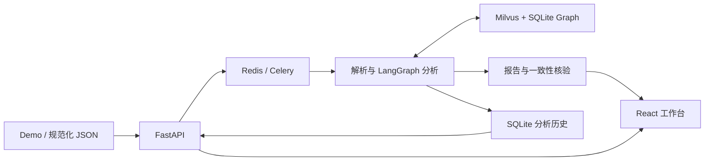

<div align="center">

# CS2 Coach Agent

**从比赛录像到可追溯的事件分析、选手画像与训练建议**

[English](README_EN.md) · [项目案例](docs/portfolio/CASE_STUDY.md) · [三分钟演示](docs/portfolio/DEMO_SCRIPT.md) · [全流程验收](docs/FULL_FLOW_VALIDATION_V3.md)

[](https://github.com/Zzz0zzZ0/CS2-coach-agent/actions/workflows/ci.yml)
[](requirements-dev.txt)
[](frontend/package.json)
[](LICENSE)

</div>

CS2 Coach Agent 是一个面向 CS2 赛事复盘的工程项目：解析真实 `.dem` 录像，将回合事件与历史检索证据连接起来，生成可核对的比赛报告，并支持选手比较、来源下钻和保存后的只读追问。

系统采用 LangGraph 编排分析节点。指标、报告事实和引用由代码生成；模型在白名单内选择训练主题。项目重点是完整的数据链路、可解释的检索边界、故障处理与可复现评测。

## 阅读导航

- 了解产品：[能做什么](#能做什么) · [选手画像与关系查询](#选手画像与关系查询)
- 了解实现：[架构与设计取舍](#架构与设计取舍) · [项目结构与进一步阅读](#项目结构与进一步阅读)
- 本地运行：[快速开始](#快速开始) · [配置与运行维护](#配置与运行维护) · [API 使用示例](#api-使用示例)
- 核查结果：[当前验证结果](#当前验证结果) · [测试与 benchmark](#测试与-benchmark) · [已知边界](#已知边界)

## 为什么做这个项目

一份听起来合理的复盘不一定能被比赛证据支持：击杀数可能使用了错误的参赛分母，检索结果可能只同时提到两名选手却没有发生指定交互，训练建议也可能把事件关联写成战术原因。这个项目把这些问题拆成可检查的输入、统计、检索和输出契约。

对使用者，目标是从一场录像找到值得继续查看的回合，并理解结论依据；对工程与研究评审，目标是能沿着报告、引用、回合事件和运行版本检查系统如何得出结果。当前定位是可运行的应用 AI 工程原型；是否改善训练效果，需要另行评价。

## 能做什么

| 功能 | 实际行为 |
| --- | --- |
| 比赛复盘 | 上传 Demo 或接收规范化 Webhook JSON；支持完整复盘、战术对照、个人训练三种模式 |
| 事实报告 | 提取击杀、道具、闪白、下包和参赛名单，计算比分、攻守表现与回合转化；保留缺失值与未知结果 |
| 历史检索 | Milvus dense + BM25 / RRF 与 SQLite 图谱协同检索；当前比赛用 `[C#]`，历史对照用 `[E#]` |
| 选手画像与对比 | 按地图、T/CT 和对手筛选；展示参赛分母、样本组成、行为与胜负关联，并跳转原始回合 |
| 关系查询 | 对支持的实体、事件及时间条件核查源记录，返回找到、范围内未找到、信息不足或不支持；支持受限计数与条件胜率 |
| 只读追问 | 查询首杀后失利、下包后失利、指定回合和指定选手；每次最多两步、20 条来源，无模型调用 |
| 执行与恢复 | 显示真实节点事件和耗时；保存输入哈希、提交版本与完整报告，支持刷新恢复和已完成任务重复投递去重 |

来源列表先加载摘要，展开时才读取正文；详情绑定任务和输入版本，切换上下文会取消未完成请求。图谱使用可滚动 SVG 展示，无额外图可视化框架。

## 当前验证结果

以下为 **2026-09-09** 的验收快照，完整记录与失败历史保留在 [验收报告](docs/FULL_FLOW_VALIDATION_V3.md) 和 [结构化结果](datasets/evaluation/full_flow_v3_report.json)。

| 验证范围 | 结果 |
| --- | --- |
| 离线测试、依赖检查、前端构建 | **354 项测试通过**；[对应 CI 成功](https://github.com/Zzz0zzZ0/CS2-coach-agent/actions/runs/34324785193) |
| 真实 Demo 全流程 | **5 张地图、111 个不同回合、三种分析模式**通过；覆盖加时赛 |
| 输入与报告来源 | 111 个回合来源 HTTP 核对通过；指标和固定报告一致性核验通过 |
| 入口与恢复 | Webhook、无效文件处理、刷新恢复、单任务 Redis 缓存失效及已完成任务重复投递通过 |
| 开发检索回归 | Vector / Graph / Hybrid 均 **50/50** |
| 原冻结查询回归 | Vector **28/30**，Graph / Hybrid 均 **30/30** |
| 结构化与关系契约 | 战术 / 选手 **30/30、20/20**；关系表达 **48/48**；聚合 **96/96** |
| 画像与页面 | 56 位选手源事件审计通过；画像比较、关系来源和桌面 / 手机图谱可达性通过 |

本轮发现并修复了内部回合主题查询误入严格关系解析的问题，五张地图的检索计划覆盖由 **12/17 恢复至 17/17**；同时修复图谱节点裁切。修复前的报告和失败证据均保留。

这一轮模型保持暂停，新增远程调用 **0**。此前另有两次连续真实云模型全链路验收，共报告 **2,325 tokens**，详情见 [模型链路与故障记录](docs/LIVE_E2E_V2.md)。两类结果分开记录。

本机历史语料快照包含 **20 场系列赛、49 张地图、1,019 个正式回合、56 位选手**，派生 **1,117 条 Milvus 文档、5,308 条战术银标和 28 个社区摘要**。这些是已验证的本地数据规模；原始录像、模型缓存与运行数据库不随仓库分发。[数据口径与重建记录](docs/HISTORICAL_DATA_REBUILD_V2.md)

## 架构与设计取舍



分析链为 `Supervisor → Tools → Router → Retrieve → Critique → Analyst → Coach → Verifier`；Demo 解析与初始化也记录到时间线。三种模式选择现有任务，不生成任意工具或执行代码。

### 一次分析如何完成

| 阶段 | 处理内容 | 可以检查的输出 |
| --- | --- | --- |
| Parse / Initialize | 解析 Demo、规范化事件，初始化检索与模型客户端 | 输入指纹、回合数、解析失败类型和阶段事件 |
| Supervisor | 按请求选择预定义模式与任务集合 | 模式、启用的任务 ID、选择来源 |
| Tools | 从当前比赛计算指标并构建当前来源 | 比分、阵营表现、首杀与下包转化、逐回合事实 |
| Router | 为首杀、道具、回合流程、地图背景生成主题查询 | `analysis_plan`、地图范围、查询变体 |
| Retrieve | 调用可用的文本与图谱路径，筛选并合并历史证据 | 来源、逐任务覆盖和检索警告 |
| Critique | 检查证据量、覆盖率、地图与队伍匹配 | 规则评分、缺失任务、是否再检索 |
| Analyst | 根据当前比赛与指标生成固定结构的分析 | 带 `[C#]` 引用的确定性事实报告 |
| Coach | 选择允许的训练主题并用模板生成建议 | 主题 ID、模型或规则选择来源、报告用量 |
| Verifier | 重算指标，核对来源和固定报告的一致性 | 四组核验结果、不一致路径与原因 |

每个执行阶段记录 `started / completed / failed`、时间和执行次数。Retrieve 重试会产生独立事件；后续未执行的节点不会被标为完成。这里的多节点编排具有明确职责，默认没有让多个 LLM 分别生成一份意见再投票。

### 模型与确定性逻辑的边界

- **先算事实，再选主题。** `demoparser2` 提取事件；Tools 计算指标。默认仅 Coach 在密钥和预算允许时调用一次 `qwen3.8-flash`，最终报告仍由确定性模板生成。辅助模型调用默认关闭。
- **文本检索与关系核验分工。** Milvus 负责历史文本召回；SQLite 保存比赛、回合、事件、选手和银标关系。严格关系问句核对源事件，不把相似文本当成关系成立的证据。社区摘要采用确定性统计。
- **有边界的检索重试。** Critique 综合证据量、任务覆盖、地图和队伍匹配评分；低于阈值且存在缺失任务时重试缺失部分，最多三轮检索。综合分通过不保证每个任务均覆盖，因此保留逐任务轨迹。
- **保存完成结果。** SQLite 记录输入哈希、源码提交、执行事件和报告。已完成任务可脱离 Redis 结果缓存读回；中断阶段自动续跑不在当前范围。
- **限制成本和写入。** 跨进程预算账本默认上限为 30,000 tokens / 100 次尝试；超时、拒绝或用量不明会暂停调用。自动知识摄取默认关闭，还要求高质量来源、逐场批准和 Verifier 通过。

技术栈：Python 3.11、FastAPI、Celery / Redis、LangGraph、Milvus 2.6、SQLite、FastEmbed / ONNX、demoparser2、React / Vite。HLTV 采集工具使用 DrissionPage。当前本地 Worker 使用 `solo` 池；这里不声明已验证多 Worker 吞吐能力。

### 证据如何流转

当前比赛的解析输入用于生成 `[C#]` 事实来源；历史检索返回 `[E#]` 对照证据，选手 / 战队简报另有 `[G#]` 引用。当前 Analyst 和 Coach 正文主要依据当前指标生成，历史证据单独展示供对照，并非由模型综合生成战术解释。引用标号属于各自报告上下文，持久来源 ID 与比赛、地图、回合关联，不能仅凭相同的显示编号跨报告复用。

上传并完成分析会保存本地任务和规范化输入，**不等于把该比赛加入历史知识库**。历史画像读取已构建的图谱，保存任务的追问读取该任务的输入快照。这两个数据范围在 API 和页面上分别处理。

历史检索不可用时，系统保留明确提示并继续当前比赛的确定性报告；这不证明历史对照已经完成。Verifier 的 `pass` 也仅表示当前实现所检查的报告契约通过，不能替代检索覆盖检查或专家判断。

## 选手画像与关系查询

### 画像统计口径

画像按地图、T/CT 与对手筛选，返回基础指标、完整样本组成、行为与结果分组以及可下钻简报。参赛分母优先来自每回合冻结时间结束时的完整双方名单，包括没有击杀或道具事件的选手；旧数据的估算分母会明确标出。

| 指标或字段 | 计算方式与解释 |
| --- | --- |
| K/D | 有效击杀数 / 死亡数；死亡为零时返回 `null`，不生成有限比值 |
| 首杀成功率 | 首杀 /（首杀 + 首死）；没有交战机会时不可计算 |
| 每百回合事件数 | 事件次数 / 当前筛选范围的参赛回合数 × 100 |
| 行为分组 | 首杀、首死、补枪、道具、致盲、下包；每种行为按唯一参赛回合分为观测 / 未观测两组 |
| 分组胜率 | 胜局 / 已知胜负回合；未知结果单列，不记作负局 |
| 胜率差 | 两组描述性胜率的百分点差；没有控制经济、角色或局势，不能解释为行为收益 |
| 数据质量 | 名单确认 / 估算、无样本、未知值和日期缺失状态；无样本不等于表现为零 |

道具记录沿用解析出的事件，致盲可能包括队友或自闪；补枪参与来自规则银标。这些都不直接等于有效助攻、正确战术或专业角色判断。各行为集合可能重叠，不可把六类回合数相加作为参赛分母。

两名选手比较使用相同筛选条件，但仍分别保留各自分母，展示共同参赛回合、共同条件覆盖与地图 / 阵营 / 对手组成差异。筛选相同并不保证样本可比；页面不输出能力排名、显著性或长期趋势。简报由确定性逻辑生成，保留数值、筛选范围与引用归属。[完整口径](docs/PLAYER_PROFILE_DATA_CONTRACT.md) · [行为定义](docs/PLAYER_BEHAVIOR_OUTCOMES.md) · [简报契约](docs/PLAYER_GROUNDED_SUMMARY.md)

### 文本检索与关系核验

历史文本检索负责查找相关回合、比赛摘要和社区背景；关系路径负责回答有明确主体和事件条件的问题，例如“下包发生后某选手击杀另一选手”“某选手为指定队友完成补枪”。支持的计数和条件胜率会扫描限定范围，再截取展示来源，分母不是返回的 top-k 条数。

| 关系状态 | 含义 |
| --- | --- |
| `found` | 有源事件支持所要求的关系 |
| `not_found` | 支持的条件已在完整限定范围内检查，没有匹配记录 |
| `unknown` | 缺少确认关系所需的名单、tick 或必要范围，无法确认是否存在匹配 |
| `unsupported` | 表达含未支持的条件，不能安全转成查询 |

`found` 表示至少有证据，不保证整个范围完整；还需检查 `complete`。胜负缺失会另外影响条件胜率的 `outcome_complete`，不会把已确认的击杀关系改成不存在。

支持受限的中英文主动 / 被动表达、tick 时间条件与聚合。秒数条件、复杂否定和复合逻辑等无法完整解析时会拒绝放宽解释。相似文本不作为关系成立的替代证明；样本不足也不补造完整胜率。[支持语法与数字契约](docs/RELATION_QUERY_ENGINE_V2.md)

## 快速开始

### 1. 安装与启动

准备 Python 3.11、Node.js 22、Docker Compose；运行真实复盘还需要你自己的 `.dem` 文件。

```bash
git clone https://github.com/Zzz0zzZ0/CS2-coach-agent.git
cd CS2-coach-agent
make bootstrap
npm --prefix frontend ci
```

`make bootstrap` 创建 `.venv`，按依赖约束安装 Python 包，仅在 `.env` 不存在时复制模板，并启动 Redis、Milvus、etcd 和 MinIO。完整配置见 [.env.example](.env.example)。

首次体验可以不填 `DASHSCOPE_API_KEY`，使用规则 Coach。需要云模型时在 `.env` 或本机页面配置有效 Key；运行时密钥文件优先于环境配置，页面不回传密钥。当前模型入口固定支持 `qwen3.8-flash` 且关闭 thinking；密钥存在不代表预算已允许调用。账本状态见页面，不通过更换密钥或重启清零。[预算说明](docs/MODEL_BUDGET_BOUNDARIES.md)

默认 `EMBEDDING_BACKEND=fastembed` 使用本地 embedding，首次下载模型需要网络；`LLM_AUXILIARY_CALLS_ENABLED=false`、`AUTONOMOUS_TOOL_SELECTION_ENABLED=false`、`AUTO_INGEST_ENABLED=false` 保持辅助调用与自动入库关闭。

终端一：

```bash
make dev
```

终端二：

```bash
make frontend
```

打开 [工作台](http://localhost:5173) 或 [API 文档](http://127.0.0.1:8001/docs)。Vite 将 `/api` 代理到 `8001`；若修改后端端口，应同步修改 [代理配置](frontend/vite.config.js)。`make dev` 启动 API 与 Worker，终止该命令会结束两者。

### 2. 提交一场比赛

在工作台选择 Demo 与分析模式，或使用 API：

```bash
curl -X POST http://127.0.0.1:8001/api/upload-demo \
  -F "file=@data/sample.dem" \
  -F "analysis_mode=demo_forensic"

# 用返回的 task_id 替换占位符
curl http://127.0.0.1:8001/api/tasks/{task_id}
```

工作台提供的三种模式为 `demo_forensic`、`tactical_comparison`、`player_coaching`。上传副本在任务结束后清理，原文件不变。简化命令行分析可用 `make analyze DEMO=data/sample.dem`；该入口不经过 Celery、未接入历史 Graph 客户端，也不保存页面任务历史，完整体验请使用上传入口。

| 工作台模式 | 默认历史检索任务 |
| --- | --- |
| `demo_forensic`：完整复盘 | 首杀交战、道具、回合流程、地图背景 |
| `tactical_comparison`：战术对照 | 道具、回合流程、地图背景 |
| `player_coaching`：个人训练 | 首杀交战、道具、回合流程 |

三种模式共用当前比赛的事实计算与核验。`player_coaching` 是比赛分析中的训练主题组合；指定某名选手的历史画像通过画像入口查看。后端另有 `data_quality_check` 模式，但不属于工作台三种模式及本轮三模式真实验收范围。

完成后可以沿着以下路径检查一份报告：

1. 查看比分、回合数和未知结果，确认当前比赛范围。
2. 查看执行时间线和逐任务检索覆盖，区分规则 Coach 与真实模型选择。
3. 展开 Verifier 的四组结果，并从报告引用进入对应回合。
4. 用“首杀后失利”“下包后失利”、指定回合或选手追问检查当前输入。
5. 刷新页面，从“已保存分析”恢复同一份报告。

`POST /api/webhook/match-end` 为通用规范化 JSON 接口，字段契约见 [MatchWebhookPayload](app/domain/match_models.py)；第三方平台的数据需先映射到该格式，当前没有原生 FACEIT / 5E 适配器。

### 3. 可选：建立历史语料

新克隆不会自动带上上述历史数据。当前比赛的确定性分析可在历史检索不可用时继续，历史画像与对照则需要准备 Demo 和索引。

将历史录像放到 `data/demos/`，先检查文档数量，再建库：

```bash
.venv/bin/python scripts/seed_knowledge.py --dry-run
make graph-build
make seed
```

这些是数据构建命令，**会重建配置的图谱，`make seed` 默认替换 `cs2_tactical_knowledge` 集合**；已有数据需先备份，实验应使用独立图谱路径或新集合，详见 [历史重建流程](docs/HISTORICAL_DATA_REBUILD_V2.md)。已有服务进程可能缓存图谱 / 检索客户端，切换数据后应在任务队列空闲时重启 API 与 Worker。

采集工具可先发现比赛，显式加 `--download` 才下载录像：

```bash
make fetch-demos ARGS="--days 7 --min-rating 2 --max-matches 10"
```

下载依赖本机 Chromium / Chrome、HLTV 页面实际提供的 Demo 链接及本地解压工具；已有录像可直接使用。[下载入口与参数](scripts/fetch_recent_demos.py)

## 配置与运行维护

### 常用配置

以下是仓库默认值，已有 `.env` 和运行时状态可能不同；完整字段以 [.env.example](.env.example) 与 [Settings](app/core/config.py) 为准。

| 配置 | 默认值 / 用途 |
| --- | --- |
| `DASHSCOPE_API_KEY` / `DASHSCOPE_KEY_FILE` | 模型密钥；运行时文件默认 `data/runtime/dashscope_api_key`，有效文件优先 |
| `MODEL_NAME` | `qwen3.8-flash`；当前项目模型入口限定该模型 |
| `LLM_TIMEOUT_SECONDS` / `LLM_MAX_TOKENS` | `120` 秒 / `1400` 输出 token 上限 |
| `LLM_BUDGET_TOKENS` / `LLM_BUDGET_MAX_CALLS` | 项目账本默认 `30000` tokens / `100` 次尝试 |
| `LLM_BUDGET_DB` | `data/runtime/llm_budget.sqlite`，保存跨进程预留、结算与暂停状态 |
| `EMBEDDING_BACKEND` / `EMBEDDING_MODEL` | `fastembed` / `sentence-transformers/paraphrase-multilingual-MiniLM-L12-v2` |
| `MILVUS_URI` / `RAG_HYBRID_ENABLED` | `http://localhost:19530` / `true` |
| `GRAPH_DB_PATH` | `data/graph/cs2_graph.sqlite`，历史图谱 |
| `ANALYSIS_RUN_DB` | `data/runtime/analysis_runs.sqlite`，任务、事件、规范化输入与报告 |
| `CELERY_BROKER_URL` / `CELERY_RESULT_BACKEND` | `redis://localhost:6379/0` / `redis://localhost:6379/1` |
| `LLM_AUXILIARY_CALLS_ENABLED` / `AUTONOMOUS_TOOL_SELECTION_ENABLED` | 均为 `false`；默认使用明确的模式与规则评审 |
| `AUTO_INGEST_ENABLED` | `false`；自动入库还要求逐场批准、高质量来源与核验通过 |

模型预算是从本地账本建立开始计算的项目额度，不是提供商余额。请求前预留用量，收到可靠 usage 后结算；未知用量不能按零消耗处理。重启服务不重置账本，页面状态也不能证明其他程序没有使用同一账户。

普通配置在进程启动时读取，修改后需在队列空闲时重启 API / Worker；页面保存的运行时密钥按需读取。`API_PORT`、`CELERY_POOL` 与 `CELERY_CONCURRENCY` 是 Make 变量，默认分别为 `8001`、`solo`、`1`，不属于上表的 `.env` 配置。

### 保存、恢复与数据位置

| 数据 | 保存内容与恢复范围 |
| --- | --- |
| 上传 Demo 副本 | 临时输入，任务结束后清理；项目不自动备份用户原始录像 |
| 分析历史 SQLite | 保存解析输入、SHA256、开始时 Git 提交、真实执行事件和完整结果；已完成任务优先从这里读回 |
| Redis | Celery 队列与结果缓存；缓存失效后，已持久化完成的报告仍可读取 |
| 历史 Graph / Milvus | 供跨比赛检索与画像使用；不会因查看或追问已保存任务自动改变 |
| `datasets/` 与 `docs/` | 可分享协议、哈希、结果摘要和实验解释；旧结果按其运行版本保留 |

相同 `task_id` 的已完成任务重复投递会返回原结果；新 ID 的同一 Demo 仍是一份新分析。失败或中断任务没有阶段自动续跑，强制结束 Worker 可能留下 `STARTED`；最后一条事件不能证明进程仍在线。运行记录目前没有自动清理策略，重要数据需自行备份。[持久化与幂等说明](docs/ANALYSIS_HISTORY_V1.md)

任务顶层 `SUCCESS` 表示执行结束，还需查看 `result.status` 是否为 `success`，以及 `result.analysis.verification_report` 的核验结果。`needs_review` 不能当作核验通过；Redis 返回 `PENDING` 也可能是 ID 不存在或结果已失效，不足以证明任务已排队。

### 常见问题

| 现象 | 检查方式与处理 |
| --- | --- |
| 页面无法请求 API | 确认 `make dev` 正在运行、`8001` 端口可用，检查 Vite `/api` 代理是否对应后端端口 |
| 上传后没有继续执行 | 检查 `make dev` 的 Worker 日志和 `make status`；后者只检查 Docker 基础服务，不确认 API / Worker 是否存活 |
| 历史画像为空或没有历史证据 | 查看图谱 `available`、地图与选手列表，确认已建库及查询范围；上传一场比赛不会自动充实历史索引 |
| embedding 第一次启动慢或下载失败 | 首次需要下载本地模型；准备网络与模型缓存，离线代码测试不需要下载 |
| Coach 显示规则建议 | 检查密钥配置与模型预算；暂停、调用失败或不合规的主题选择可触发回退，任务成功不代表本次调用了模型 |
| 预算报告 `configuration_mismatch` | 检查配置额度是否与已有账本一致；恢复正确配置并审计记录，删除账本或改路径会破坏预算连续性 |
| 来源详情返回 `409` | 保存输入的版本不匹配或任务尚不可查询；重新读取任务与回答，再请求绑定版本的来源 |
| 历史读取返回 `503` | 检查本地 SQLite 路径、访问权限与完整性，保留损坏文件供排查，不把它当作一个不存在的新任务 |
| 重建索引后仍显示旧数据 | 在队列空闲时重启 API 与 Worker，避免继续使用进程内缓存的旧客户端 |

`make status` 查看基础服务；结束两个开发终端会停止 API / Worker 和 Vite。`make clean` 执行 Docker Compose down，停止并移除基础服务容器，保留绑定在 `data/` 下的文件；需要再次使用时运行 `make infra`。改端口可使用 `make dev API_PORT=8002`，同时调整前端代理。

## API 使用示例

完整字段与响应以 [本地 OpenAPI](http://127.0.0.1:8001/docs) 为准。以下读请求不会重新提交分析；画像和关系示例需要已有历史图谱，任务追问需要已完成且保存输入的任务。

| 接口 | 用途 |
| --- | --- |
| `POST /api/upload-demo` | 上传 `.dem`，返回异步任务 ID |
| `POST /api/webhook/match-end` | 提交符合领域契约的比赛 JSON |
| `GET /api/tasks?limit=20` | 列出本地保存任务，最多 100 条 |
| `GET /api/tasks/{task_id}` | 读取状态、执行事件和完成结果 |
| `GET /api/tasks/{task_id}/questions` | 四类受限只读追问 |
| `GET /api/graph/stats`、`/maps`、`/players` | 查看历史图谱状态、地图和选手；选手列表最多 100 名 |
| `GET /api/graph/players/{player_id}` | 按地图、阵营、对手筛选单人画像 |
| `GET /api/graph/players/compare` | 比较恰好两名不同选手及其样本组成 |
| `GET /api/graph/search` | 受限关系查询或历史图谱检索，可指定 `map_name` 与 `match_id` |
| `GET /api/graph/round` | 通过返回的 `source_id` 查看历史回合 |
| `GET /api/settings/llm`、`/api/settings/llm/budget` | 查看密钥是否配置和项目预算状态，不返回密钥正文 |

查看可用历史数据：

```bash
curl http://127.0.0.1:8001/api/graph/stats
curl http://127.0.0.1:8001/api/graph/maps
curl 'http://127.0.0.1:8001/api/graph/players?limit=100'
curl 'http://127.0.0.1:8001/api/tasks?limit=20'
```

先从选手列表取得实际 `player_id`。以下占位符需替换为当前图谱中的两名不同选手；筛选后无样本会保留无样本说明。

```bash
curl -G 'http://127.0.0.1:8001/api/graph/players/compare' \
  --data-urlencode 'players=PLAYER_ID_A,PLAYER_ID_B' \
  --data-urlencode 'map_name=Nuke' \
  --data-urlencode 'side=CT'
```

只读追问示例中，`TASK_ID` 替换为保存的任务 ID，回合编号替换为该比赛的真实编号；`detail=compact` 先返回摘要，默认 `full` 返回完整来源：

```bash
curl -G 'http://127.0.0.1:8001/api/tasks/TASK_ID/questions' \
  --data-urlencode 'kind=opening_losses' \
  --data-urlencode 'detail=compact'

curl -G 'http://127.0.0.1:8001/api/tasks/TASK_ID/questions' \
  --data-urlencode 'kind=round' \
  --data-urlencode 'round_number=13'
```

其余类型为 `kind=post_plant_losses` 和 `kind=player&player=选手精确名称`。每次最多两步、至多处理 1,000 个输入回合、最多展示 20 条来源；统计基于完整允许范围，展示截断会明确标记。页面还通过 `expected_payload_sha256` 固定输入版本，并核对任务、来源 ID 与引用；切换上下文取消待处理请求。[追问契约](docs/REPORT_QUESTIONS_V1.md) · [按需加载契约](docs/SOURCE_LOADING_V1.md)

## 测试与 benchmark

### 无密钥离线验证

若只验证代码，无需 Docker 或比赛数据。在仓库根目录安装依赖后运行：

```bash
python3.11 -m venv .venv
.venv/bin/python -m pip install -r requirements-dev.txt -c requirements-lock.txt
.venv/bin/python -m pip check
make test
npm --prefix frontend ci
make frontend-build
```

安装需要网络，测试执行不需要模型、Redis、Milvus 或 embedding 下载。测试隔离 `.env`、使用临时 SQLite，并拦截 Python socket 联网；CI 使用相同依赖约束和前端锁文件。[离线验证说明](docs/OFFLINE_VALIDATION.md)

### 真实语料回归

准备匹配的历史图谱、Milvus 和本地 embedding 后，将结果写入新的本地目录：

```bash
make eval-v1 ARGS="--output data/evaluation/readme-run/development.json"
make eval-v1 ARGS="--retrieval-dataset datasets/evaluation/retrieval_queries_holdout_v1.json --output data/evaluation/readme-run/holdout.json"
```

再次运行时更换输出目录，保留原报告；冻结输入不要改写。退出码主要检查生产 Graph / Hybrid 与结构化契约，Vector 的两项既有 `intent_match` 失败仍需读取报告。这里的查询通过率是工程检查，不等于标准 Recall@k；综合分也不能用于比较各方法并不相同的结构化能力。

### 同语料检索对照

[中英文基线实验](docs/LANGUAGE_BASELINES_V2.md)包含 768 条历史开发结果；[隔离比赛试点](docs/ISOLATED_RELATION_PILOT_V1.md)包含两场已观察系列上的 960 条文本结果和 60 条关系表达验证。


图中为开发评测，使用 AI 辅助标签；不同 dense 模型的实际分块容量也不同。Jina 的历史开发 nDCG@5 高于 MiniLM，但隔离试点中的优势随系列变化，RRF 并未稳定改善结果；未经拒答校准的文本 top-k 方法仍对无答案题返回结果。[图表数据与生成依据](docs/portfolio/benchmark-figure-manifest.json)

原始问法、`k=5`，正例先按中英文语义配对再平均：

| 方法 | 历史开发 nDCG@5 | 历史开发 Recall@5 | 隔离试点 nDCG@5 | 隔离试点 Recall@5 |
| --- | ---: | ---: | ---: | ---: |
| unicode61 BM25 | 0.1492 | 0.2569 | 0.1584 | 0.2222 |
| 预训练子词 BM25 | 0.1660 | 0.2083 | 0.2036 | 0.3000 |
| MiniLM dense | 0.1476 | 0.2188 | 0.2028 | 0.2500 |
| Jina 中英 dense | 0.3148 | 0.3819 | 0.2213 | 0.3778 |
| unicode61 + Jina RRF | 0.2277 | 0.3299 | 0.1583 | 0.2278 |
| 子词 + Jina RRF | 0.2653 | 0.3021 | 0.1560 | 0.2333 |

- **指标含义：** Recall@5 是前五条覆盖的相关回合比例；nDCG@5 同时衡量相关性与排序位置。两者均依赖本实验标签，不直接衡量建议质量。
- **样本单位：** 历史开发为 12 个正例 / 12 个无答案语义组；隔离试点为 15 / 15 组。中英文改写不是独立比赛样本，768 / 960 是实验结果行数，不是独立问题数。
- **可比范围：** 同一实验内方法使用相同源事实语料和显式实体 / 范围，标签只用于排序后评分。MiniLM 与 Jina 的实际分块容量分别为 128 / 512，提升只能归因于整套配置；生产默认仍是 MiniLM。
- **保留失败：** 上述未校准拒答的文本方法在无答案组均有 100% 误召回。隔离试点中两场系列对模型的偏好方向不同，不能把整体均值当作普遍领先的证明。
- **关系路径单独验收：** 60/60 中英文表达及 780 项状态、数值、事件证明与接口检查通过，15 个无答案组没有伪关系证据；这是受限确定性契约结果，不能与文本排名拼成一个“GraphRAG 提升率”。

### 评测应如何复现与扩展

仓库保存查询、协议、结果摘要和文件哈希；原始 Demo、模型文件、完整运行数据库留在本地。离线测试可以从代码克隆复现，真实语料实验还需要匹配的数据与模型制品。不同版本的引用和统计必须配套当时的图谱快照，不能把旧协议直接指向重建后的索引。

语言与隔离试点文档提供冻结提交、模型 revision 和复现命令；本机绝对路径需映射到自己的文件，并继续核对哈希。运行结果写入新文件，保留原始失败。既有冻结问题已经被观察，不因换一次输出目录就变成新盲测。

下一阶段研究应先在独立开发数据上校准拒答，再冻结新系列的选择、自然问题、标签与参数，最后一次性评估；独立教练质量评价仍待条件具备后开展。[正式 benchmark 方案](docs/BENCHMARK_PLAN.md)

### 已测量的工程优化

| 改动 | 测量结果 | 解释范围 |
| --- | --- | --- |
| 画像查询提前跳过名单确认未参赛的回合 | 56 名选手 × 4 种筛选，224/224 完整 JSON 相同；函数耗时中位数 335.31 → 104.08 ms | 本机一次交错、预热缓存测量；不是冷启动或并发吞吐保证 |
| 追问来源按需加载 | 一场 14 回合比赛的列表首次 JSON 正文减少 55.16%–66.56% | 单回合详情不减少；全部展开会增加总请求与正文，不等于整页流量或模型 token 节省 |

相关协议、原始输出与代价见 [画像性能核验](docs/PLAYER_PERFORMANCE_V1.md) 和 [来源加载测量](docs/SOURCE_LOADING_V1.md)。项目将输出等价性与速度分别核对，避免以缩小统计范围换取表面加速。

## 已知边界

- Verifier 检查规范化输入、派生指标、当前来源与固定报告模板的一致性；共享同一解析与计算链，不能充当独立事实裁判，也未验证历史证据的完整语义支持。
- 选手统计使用实际参赛分母，并显示样本组成与未知值；观测关联不证明因果、能力排名或训练效果。比赛日期和可比长期样本不足，暂不输出趋势结论。
- 回归集和五图试点已经被观察；AI 标签与规则银标不等于独立人工金标。真人 Coach 质量盲评延期，模型质量增益仍未评分。
- 当前以本地工作台为部署目标；外网部署的身份认证、多租户隔离和负载能力不属于本轮验收。模型账本只统计本项目入口，不代表提供商账户剩余额度。

## 项目结构与进一步阅读

```text
app/
├── api/routers/           # 上传、Webhook、任务、追问、图谱与配置接口
├── agentic/              # LangGraph 状态、节点与执行事件
├── core/                 # 配置、服务提供者、Celery、模型预算
├── domain/               # 比赛与分析结果的数据契约
├── services/
│   ├── parser_service.py       # Demo 事件与名单解析
│   ├── metrics_service.py      # 确定性指标与当前来源
│   ├── rag_service.py          # Milvus 文本召回与证据筛选
│   ├── graph_rag_service.py    # 历史图谱、画像与社区检索
│   ├── relation_query_service.py # 受限关系解析与源事件核验
│   ├── report_verification.py  # 报告一致性检查
│   ├── analysis_runs.py        # SQLite 任务历史与输入哈希
│   ├── followup_service.py     # 保存比赛的只读追问
│   └── tasks.py                # Celery 入口、持久化与清理
└── scrapers/             # HLTV 发现与下载
frontend/                 # React / Vite 工作台
scripts/                  # 数据构建、审核与评测脚本
datasets/                 # 选择清单、冻结查询、银标与可分享结果
docs/                     # 实现契约、实验记录和展示材料
test_*.py                 # 离线回归测试
data/、output/            # 本地运行数据，不进入 Git
```

| 阅读目的 | 文档 |
| --- | --- |
| 项目展示 / 求职与申请 | [英文案例](docs/portfolio/CASE_STUDY.md) · [中文材料说明](docs/portfolio/APPLICATION_NOTES_ZH.md) · [演示脚本](docs/portfolio/DEMO_SCRIPT.md) |
| 画像与数据口径 | [分母与对比](docs/PLAYER_PROFILE_DATA_CONTRACT.md) · [行为与结果](docs/PLAYER_BEHAVIOR_OUTCOMES.md) |
| 关系查询 | [关系与聚合契约](docs/RELATION_QUERY_ENGINE_V2.md) |
| 运行可靠性 | [历史与幂等](docs/ANALYSIS_HISTORY_V1.md) · [报告核验与追问](docs/REPORT_QUESTIONS_V1.md) · [来源按需加载](docs/SOURCE_LOADING_V1.md) |
| 性能测量 | [画像输出等价与耗时](docs/PLAYER_PERFORMANCE_V1.md) · [来源传输量与代价](docs/SOURCE_LOADING_V1.md) |
| 版本与研究规划 | [执行进度](docs/IMPLEMENTATION_PROGRESS.md) · [后续路线](docs/PROJECT_IMPROVEMENT_ROADMAP.md) · [正式 benchmark 方案](docs/BENCHMARK_PLAN.md) |

## 许可证

[MIT](LICENSE)
