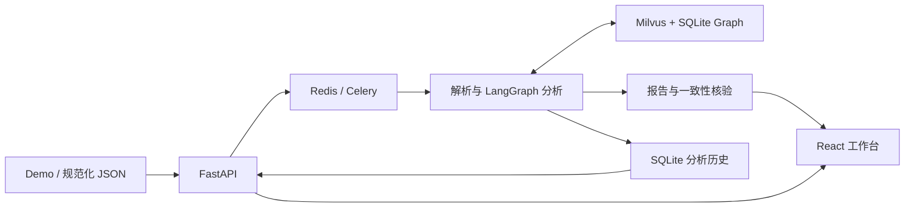

<div align="center">

# CS2 Coach Agent

**从比赛录像到可追溯的事件分析、选手画像与训练建议**

[English](README_EN.md) · [项目案例](docs/portfolio/CASE_STUDY.md) · [三分钟演示](docs/portfolio/DEMO_SCRIPT.md) · [全流程验收](docs/FULL_FLOW_VALIDATION_V3.md)

[](https://github.com/Zzz0zzZ0/CS2-coach-agent/actions/workflows/ci.yml)
[](requirements-dev.txt)
[](frontend/package.json)
[](LICENSE)

</div>

CS2 Coach Agent 是一个面向 CS2 赛事复盘的工程项目：解析真实 `.dem` 录像，将回合事件与历史检索证据连接起来，生成可核对的比赛报告，并支持选手比较、来源下钻和保存后的只读追问。

系统采用 LangGraph 编排分析节点。指标、报告事实和引用由代码生成；模型在白名单内选择训练主题。项目重点是完整的数据链路、可解释的检索边界、故障处理与可复现评测。

## 能做什么

| 功能 | 实际行为 |
| --- | --- |
| 比赛复盘 | 上传 Demo 或接收规范化 Webhook JSON；支持完整复盘、战术对照、个人训练三种模式 |
| 事实报告 | 提取击杀、道具、闪白、下包和参赛名单，计算比分、攻守表现与回合转化；保留缺失值与未知结果 |
| 历史检索 | Milvus dense + BM25 / RRF 与 SQLite 图谱协同检索；当前比赛用 `[C#]`，历史对照用 `[E#]` |
| 选手画像与对比 | 按地图、T/CT 和对手筛选；展示参赛分母、样本组成、行为与胜负关联，并跳转原始回合 |
| 关系查询 | 对支持的实体、事件及时间条件核查源记录，返回找到、范围内未找到、信息不足或不支持；支持受限计数与条件胜率 |
| 只读追问 | 查询首杀后失利、下包后失利、指定回合和指定选手；每次最多两步、20 条来源，无模型调用 |
| 执行与恢复 | 显示真实节点事件和耗时；保存输入哈希、提交版本与完整报告，支持刷新恢复和已完成任务重复投递去重 |

来源列表先加载摘要，展开时才读取正文；详情绑定任务和输入版本，切换上下文会取消未完成请求。图谱使用可滚动 SVG 展示，无额外图可视化框架。

## 当前验证结果

以下为 **2026-09-09** 的验收快照，完整记录与失败历史保留在 [验收报告](docs/FULL_FLOW_VALIDATION_V3.md) 和 [结构化结果](datasets/evaluation/full_flow_v3_report.json)。

| 验证范围 | 结果 |
| --- | --- |
| 离线测试、依赖检查、前端构建 | **354 项测试通过**；[对应 CI 成功](https://github.com/Zzz0zzZ0/CS2-coach-agent/actions/runs/34324785193) |
| 真实 Demo 全流程 | **5 张地图、111 个不同回合、三种分析模式**通过；覆盖加时赛 |
| 输入与报告来源 | 111 个回合来源 HTTP 核对通过；指标和固定报告一致性核验通过 |
| 入口与恢复 | Webhook、无效文件处理、刷新恢复、单任务 Redis 缓存失效及已完成任务重复投递通过 |
| 开发检索回归 | Vector / Graph / Hybrid 均 **50/50** |
| 原冻结查询回归 | Vector **28/30**，Graph / Hybrid 均 **30/30** |
| 结构化与关系契约 | 战术 / 选手 **30/30、20/20**；关系表达 **48/48**；聚合 **96/96** |
| 画像与页面 | 56 位选手源事件审计通过；画像比较、关系来源和桌面 / 手机图谱可达性通过 |

本轮发现并修复了内部回合主题查询误入严格关系解析的问题，五张地图的检索计划覆盖由 **12/17 恢复至 17/17**；同时修复图谱节点裁切。修复前的报告和失败证据均保留。

这一轮模型保持暂停，新增远程调用 **0**。此前另有两次连续真实云模型全链路验收，共报告 **2,325 tokens**，详情见 [模型链路与故障记录](docs/LIVE_E2E_V2.md)。两类结果分开记录。

本机历史语料快照包含 **20 场系列赛、49 张地图、1,019 个正式回合、56 位选手**，派生 **1,117 条 Milvus 文档、5,308 条战术银标和 28 个社区摘要**。这些是已验证的本地数据规模；原始录像、模型缓存与运行数据库不随仓库分发。[数据口径与重建记录](docs/HISTORICAL_DATA_REBUILD_V2.md)

## 架构与设计取舍



分析链为 `Supervisor → Tools → Router → Retrieve → Critique → Analyst → Coach → Verifier`；Demo 解析与初始化也记录到时间线。三种模式选择现有任务，不生成任意工具或执行代码。

- **先算事实，再选主题。** `demoparser2` 提取事件；Tools 计算指标。默认仅 Coach 在密钥和预算允许时调用一次 `qwen3.8-flash`，最终报告仍由确定性模板生成。辅助模型调用默认关闭。
- **文本检索与关系核验分工。** Milvus 负责历史文本召回；SQLite 保存比赛、回合、事件、选手和银标关系。严格关系问句核对源事件，不把相似文本当成关系成立的证据。社区摘要采用确定性统计。
- **有边界的检索重试。** Critique 综合证据量、任务覆盖、地图和队伍匹配评分；低于阈值且存在缺失任务时重试缺失部分，最多三轮检索。综合分通过不保证每个任务均覆盖，因此保留逐任务轨迹。
- **保存完成结果。** SQLite 记录输入哈希、源码提交、执行事件和报告。已完成任务可脱离 Redis 结果缓存读回；中断阶段自动续跑不在当前范围。
- **限制成本和写入。** 跨进程预算账本默认上限为 30,000 tokens / 100 次尝试；超时、拒绝或用量不明会暂停调用。自动知识摄取默认关闭，还要求高质量来源、逐场批准和 Verifier 通过。

技术栈：Python 3.11、FastAPI、Celery / Redis、LangGraph、Milvus 2.6、SQLite、FastEmbed / ONNX、demoparser2、React / Vite。HLTV 采集工具使用 DrissionPage。当前本地 Worker 使用 `solo` 池；这里不声明已验证多 Worker 吞吐能力。

## 快速开始

### 1. 安装与启动

准备 Python 3.11、Node.js 22、Docker Compose；运行真实复盘还需要你自己的 `.dem` 文件。

```bash
git clone https://github.com/Zzz0zzZ0/CS2-coach-agent.git
cd CS2-coach-agent
make bootstrap
npm --prefix frontend ci
```

`make bootstrap` 创建 `.venv`，按依赖约束安装 Python 包，仅在 `.env` 不存在时复制模板，并启动 Redis、Milvus、etcd 和 MinIO。完整配置见 [.env.example](.env.example)。

首次体验可以不填 `DASHSCOPE_API_KEY`，使用规则 Coach。需要云模型时在 `.env` 或本机页面配置有效 Key；运行时密钥文件优先于环境配置，页面不回传密钥。当前模型入口固定支持 `qwen3.8-flash` 且关闭 thinking；密钥存在不代表预算已允许调用。账本状态见页面，不通过更换密钥或重启清零。[预算说明](docs/MODEL_BUDGET_BOUNDARIES.md)

默认 `EMBEDDING_BACKEND=fastembed` 使用本地 embedding，首次下载模型需要网络；`LLM_AUXILIARY_CALLS_ENABLED=false`、`AUTONOMOUS_TOOL_SELECTION_ENABLED=false`、`AUTO_INGEST_ENABLED=false` 保持辅助调用与自动入库关闭。

终端一：

```bash
make dev
```

终端二：

```bash
make frontend
```

打开 [工作台](http://localhost:5173) 或 [API 文档](http://127.0.0.1:8001/docs)。Vite 将 `/api` 代理到 `8001`；若修改后端端口，应同步修改 [代理配置](frontend/vite.config.js)。`make dev` 启动 API 与 Worker，终止该命令会结束两者。

### 2. 提交一场比赛

在工作台选择 Demo 与分析模式，或使用 API：

```bash
curl -X POST http://127.0.0.1:8001/api/upload-demo \
  -F "file=@data/sample.dem" \
  -F "analysis_mode=demo_forensic"

# 用返回的 task_id 替换占位符
curl http://127.0.0.1:8001/api/tasks/{task_id}
```

工作台提供的三种模式为 `demo_forensic`、`tactical_comparison`、`player_coaching`。上传副本在任务结束后清理，原文件不变。简化命令行分析可用 `make analyze DEMO=data/sample.dem`；该入口不经过 Celery、未接入历史 Graph 客户端，也不保存页面任务历史，完整体验请使用上传入口。

`POST /api/webhook/match-end` 为通用规范化 JSON 接口，字段契约见 [MatchWebhookPayload](app/domain/match_models.py)；第三方平台的数据需先映射到该格式，当前没有原生 FACEIT / 5E 适配器。

### 3. 可选：建立历史语料

新克隆不会自动带上上述历史数据。当前比赛的确定性分析可在历史检索不可用时继续，历史画像与对照则需要准备 Demo 和索引。

将历史录像放到 `data/demos/`，先检查文档数量，再建库：

```bash
.venv/bin/python scripts/seed_knowledge.py --dry-run
make graph-build
make seed
```

这些是数据构建命令，**会重建配置的图谱，`make seed` 默认替换 `cs2_tactical_knowledge` 集合**；已有数据需先备份，实验应使用独立图谱路径或新集合，详见 [历史重建流程](docs/HISTORICAL_DATA_REBUILD_V2.md)。已有服务进程可能缓存图谱 / 检索客户端，切换数据后应在任务队列空闲时重启 API 与 Worker。

采集工具可先发现比赛，显式加 `--download` 才下载录像：

```bash
make fetch-demos ARGS="--days 7 --min-rating 2 --max-matches 10"
```

下载依赖本机 Chromium / Chrome、HLTV 页面实际提供的 Demo 链接及本地解压工具；已有录像可直接使用。[下载入口与参数](scripts/fetch_recent_demos.py)

## 测试与 benchmark

### 无密钥离线验证

若只验证代码，无需 Docker 或比赛数据。在仓库根目录安装依赖后运行：

```bash
python3.11 -m venv .venv
.venv/bin/python -m pip install -r requirements-dev.txt -c requirements-lock.txt
.venv/bin/python -m pip check
make test
npm --prefix frontend ci
make frontend-build
```

安装需要网络，测试执行不需要模型、Redis、Milvus 或 embedding 下载。测试隔离 `.env`、使用临时 SQLite，并拦截 Python socket 联网；CI 使用相同依赖约束和前端锁文件。[离线验证说明](docs/OFFLINE_VALIDATION.md)

### 真实语料回归

准备匹配的历史图谱、Milvus 和本地 embedding 后，将结果写入新的本地目录：

```bash
make eval-v1 ARGS="--output data/evaluation/readme-run/development.json"
make eval-v1 ARGS="--retrieval-dataset datasets/evaluation/retrieval_queries_holdout_v1.json --output data/evaluation/readme-run/holdout.json"
```

再次运行时更换输出目录，保留原报告；冻结输入不要改写。退出码主要检查生产 Graph / Hybrid 与结构化契约，Vector 的两项既有 `intent_match` 失败仍需读取报告。这里的查询通过率是工程检查，不等于标准 Recall@k；综合分也不能用于比较各方法并不相同的结构化能力。

### 同语料检索对照

[中英文基线实验](docs/LANGUAGE_BASELINES_V2.md)包含 768 条历史开发结果；[隔离比赛试点](docs/ISOLATED_RELATION_PILOT_V1.md)包含两场已观察系列上的 960 条文本结果和 60 条关系表达验证。


图中为开发评测，使用 AI 辅助标签；不同 dense 模型的实际分块容量也不同。Jina 的历史开发 nDCG@5 高于 MiniLM，但隔离试点中的优势随系列变化，RRF 并未稳定改善结果；未经拒答校准的文本 top-k 方法仍对无答案题返回结果。[图表数据与生成依据](docs/portfolio/benchmark-figure-manifest.json)

## 已知边界

- Verifier 检查规范化输入、派生指标、当前来源与固定报告模板的一致性；共享同一解析与计算链，不能充当独立事实裁判，也未验证历史证据的完整语义支持。
- 选手统计使用实际参赛分母，并显示样本组成与未知值；观测关联不证明因果、能力排名或训练效果。比赛日期和可比长期样本不足，暂不输出趋势结论。
- 回归集和五图试点已经被观察；AI 标签与规则银标不等于独立人工金标。真人 Coach 质量盲评延期，模型质量增益仍未评分。
- 当前以本地工作台为部署目标；外网部署的身份认证、多租户隔离和负载能力不属于本轮验收。模型账本只统计本项目入口，不代表提供商账户剩余额度。

## 项目结构与进一步阅读

```text
app/
├── api/routers/           # 上传、Webhook、任务、追问、图谱与配置接口
├── agentic/              # LangGraph 状态、节点与执行事件
├── core/                 # 配置、服务提供者、Celery、模型预算
├── domain/               # 比赛与分析结果的数据契约
├── services/
│   ├── parser_service.py       # Demo 事件与名单解析
│   ├── metrics_service.py      # 确定性指标与当前来源
│   ├── rag_service.py          # Milvus 文本召回与证据筛选
│   ├── graph_rag_service.py    # 历史图谱、画像与社区检索
│   ├── relation_query_service.py # 受限关系解析与源事件核验
│   ├── report_verification.py  # 报告一致性检查
│   ├── analysis_runs.py        # SQLite 任务历史与输入哈希
│   ├── followup_service.py     # 保存比赛的只读追问
│   └── tasks.py                # Celery 入口、持久化与清理
└── scrapers/             # HLTV 发现与下载
frontend/                 # React / Vite 工作台
scripts/                  # 数据构建、审核与评测脚本
datasets/                 # 选择清单、冻结查询、银标与可分享结果
docs/                     # 实现契约、实验记录和展示材料
test_*.py                 # 离线回归测试
data/、output/            # 本地运行数据，不进入 Git
```

| 阅读目的 | 文档 |
| --- | --- |
| 项目展示 / 求职与申请 | [英文案例](docs/portfolio/CASE_STUDY.md) · [中文材料说明](docs/portfolio/APPLICATION_NOTES_ZH.md) · [演示脚本](docs/portfolio/DEMO_SCRIPT.md) |
| 画像与数据口径 | [分母与对比](docs/PLAYER_PROFILE_DATA_CONTRACT.md) · [行为与结果](docs/PLAYER_BEHAVIOR_OUTCOMES.md) |
| 关系查询 | [关系与聚合契约](docs/RELATION_QUERY_ENGINE_V2.md) |
| 运行可靠性 | [历史与幂等](docs/ANALYSIS_HISTORY_V1.md) · [报告核验与追问](docs/REPORT_QUESTIONS_V1.md) · [来源按需加载](docs/SOURCE_LOADING_V1.md) |
| 性能测量 | [画像输出等价与耗时](docs/PLAYER_PERFORMANCE_V1.md) · [来源传输量与代价](docs/SOURCE_LOADING_V1.md) |
| 版本与研究规划 | [执行进度](docs/IMPLEMENTATION_PROGRESS.md) · [后续路线](docs/PROJECT_IMPROVEMENT_ROADMAP.md) · [正式 benchmark 方案](docs/BENCHMARK_PLAN.md) |

## 许可证

[MIT](LICENSE)
