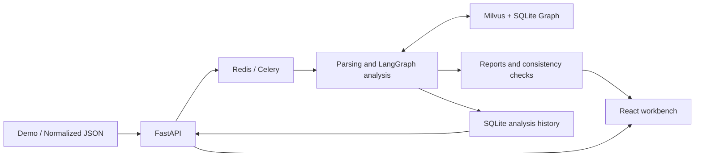
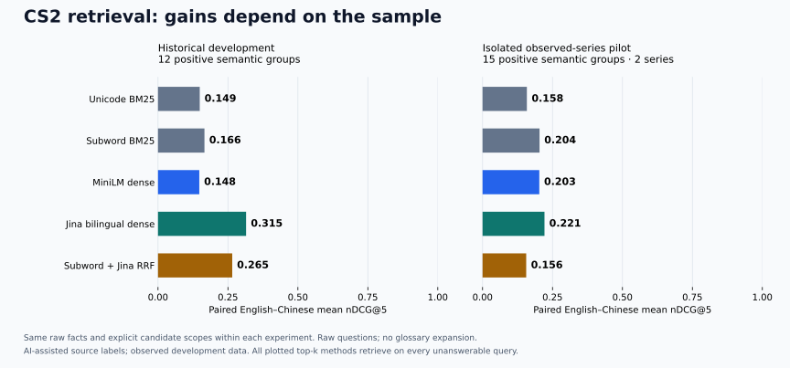

<div align="center">

# CS2 Coach Agent

**From match demos to traceable event analysis, player profiles and training suggestions**

[中文](README.md) · [Case study](docs/portfolio/CASE_STUDY.md) · [Three-minute demo](docs/portfolio/DEMO_SCRIPT.md) · [End-to-end validation](docs/FULL_FLOW_VALIDATION_V3.md)

[](https://github.com/Zzz0zzZ0/CS2-coach-agent/actions/workflows/ci.yml)
[](requirements-dev.txt)
[](frontend/package.json)
[](LICENSE)

</div>

CS2 Coach Agent is an engineering project for reviewing CS2 matches. It parses real `.dem` recordings, connects round events with evidence retrieved from historical matches, and produces reports whose claims can be checked. It also supports player comparisons, source inspection and read-only questions over saved analyses.

LangGraph orchestrates the analysis nodes. Code generates the metrics, factual reports and citations; the model selects training topics from an allowlist. The project focuses on the complete data pipeline, explainable retrieval boundaries, failure handling and reproducible evaluation.

## Reading guide

- Explore the product: [Capabilities](#capabilities) · [Player profiles and relation queries](#player-profiles-and-relation-queries)
- Understand the implementation: [Architecture and tradeoffs](#architecture-and-tradeoffs) · [Project structure and further reading](#project-structure-and-further-reading)
- Run locally: [Quick start](#quick-start) · [Configuration and operations](#configuration-and-operations) · [API examples](#api-examples)
- Check the evidence: [Current validation results](#current-validation-results) · [Tests and benchmarks](#tests-and-benchmarks) · [Known boundaries](#known-boundaries)

## Why this project

A plausible match review is not necessarily supported by match evidence. Kill statistics may use the wrong participation denominator, retrieved text may mention two players without the specified interaction ever occurring, and training advice may turn event associations into tactical causes. This project breaks those problems into inspectable input, statistical, retrieval and output contracts.

For users, the aim is to identify rounds worth reviewing and understand the evidence behind each conclusion. For engineering and research reviewers, the aim is to trace the system's results through reports, citations, round events and the version that produced them. The current scope is a working applied-AI engineering prototype; whether it improves training outcomes requires a separate evaluation.

## Capabilities

| Feature | Actual behavior |
| --- | --- |
| Match review | Upload a Demo or submit normalized Webhook JSON; choose full review, tactical comparison or player coaching |
| Factual reports | Extract kills, utility, flashes, plants and rosters; calculate scores, side performance and round conversion while preserving missing values and unknown outcomes |
| Historical retrieval | Combine Milvus dense + BM25 / RRF retrieval with a SQLite graph; cite the current match as `[C#]` and historical comparisons as `[E#]` |
| Player profiles and comparisons | Filter by map, T/CT side and opponent; show participation denominators, sample composition and associations between behavior and outcomes, with links to source rounds |
| Relation queries | Check source records for supported entities, events and temporal conditions; return found, not found within scope, insufficient information or unsupported; support bounded counts and conditional win rates |
| Read-only follow-ups | Query losses after an opening kill, post-plant losses, a specific round or a specific player; at most two steps and 20 sources per question, with no model calls |
| Execution and recovery | Show actual node events and durations; save the input hash, source commit and complete report; restore reports after refresh and deduplicate redelivery of completed tasks |

Source lists load summaries first and fetch the body on expansion. Details are pinned to the task and input version; changing context cancels pending requests. The graph uses a scrollable SVG without an additional graph visualization framework.

## Current validation results

This is the acceptance snapshot from **2026-09-09**. Full records and failure history are retained in the [validation report](docs/FULL_FLOW_VALIDATION_V3.md) and [structured results](datasets/evaluation/full_flow_v3_report.json).

| Validation scope | Result |
| --- | --- |
| Offline tests, dependency checks and frontend build | **354 tests passed**; [corresponding CI passed](https://github.com/Zzz0zzZ0/CS2-coach-agent/actions/runs/34324785193) |
| Real Demo end-to-end flows | **5 maps, 111 distinct rounds and three analysis modes** passed, including overtime |
| Input and report sources | HTTP checks passed for all 111 round sources; metrics and fixed-report consistency checks passed |
| Entry points and recovery | Webhook, invalid-file handling, refresh recovery, loss of one task's Redis cache and redelivery of a completed task passed |
| Development retrieval regression | Vector / Graph / Hybrid each **50/50** |
| Original frozen-query regression | Vector **28/30**; Graph / Hybrid each **30/30** |
| Structured and relation contracts | Tactical / player queries **30/30, 20/20**; relation expressions **48/48**; aggregation **96/96** |
| Profiles and UI | Source-event audits passed for 56 players; profile comparison, relation sources and graph reachability on desktop / mobile passed |

This run found and fixed internal round-topic queries being routed into the strict relation parser, restoring retrieval-plan coverage across the five maps from **12/17 to 17/17**. Clipped graph nodes were also fixed. Reports and failure evidence from before the fixes remain available.

The model stayed paused during this run, with **0** new remote calls. Two earlier consecutive end-to-end runs used the real cloud model and reported **2,325 tokens** in total; see the [model-path and failure record](docs/LIVE_E2E_V2.md). The two sets of results are recorded separately.

The local historical corpus snapshot contains **20 series, 49 maps, 1,019 official rounds and 56 players**, yielding **1,117 Milvus documents, 5,308 tactical silver labels and 28 community summaries**. These are verified local data volumes; raw demos, model caches and runtime databases are not distributed with the repository. [Data definitions and rebuild record](docs/HISTORICAL_DATA_REBUILD_V2.md)

## Architecture and tradeoffs



The analysis chain is `Supervisor → Tools → Router → Retrieve → Critique → Analyst → Coach → Verifier`; Demo parsing and initialization are also recorded in the timeline. The three modes select existing tasks without generating arbitrary tools or executing code.

### How an analysis runs

| Stage | Processing | Inspectable output |
| --- | --- | --- |
| Parse / Initialize | Parse the Demo, normalize events and initialize retrieval and model clients | Input fingerprint, round count, parsing failure type and stage events |
| Supervisor | Select a predefined mode and task set from the request | Mode, enabled task IDs and selection source |
| Tools | Compute current-match metrics and build current sources | Score, side performance, opening and post-plant conversion, and round-level facts |
| Router | Generate topic queries for opening duels, utility, round flow and map context | `analysis_plan`, map scope and query variants |
| Retrieve | Use the available text and graph paths, then filter and merge historical evidence | Sources, per-task coverage and retrieval warnings |
| Critique | Check evidence quantity, coverage, map matching and team matching | Rule-based score, missing tasks and whether to retrieve again |
| Analyst | Generate a fixed-structure analysis from the current match and metrics | Deterministic factual report with `[C#]` citations |
| Coach | Select allowed training topics and render suggestions through templates | Topic IDs, model or rule-based selection source, and reported usage |
| Verifier | Recompute metrics and check source and fixed-report consistency | Four check groups, mismatch paths and reasons |

Each execution stage records `started / completed / failed`, timing and attempt counts. Retrieve retries produce separate events; downstream nodes that did not run are not marked complete. The nodes have distinct responsibilities; by default, this does not involve several LLMs independently producing opinions and voting on them.

### Boundaries between model and deterministic logic

- **Compute facts, then select topics.** `demoparser2` extracts events and Tools calculates metrics. By default, only Coach makes one `qwen3.8-flash` call when the key and budget allow it; deterministic templates still generate the final report. Auxiliary model calls are disabled by default.
- **Separate text retrieval from relation verification.** Milvus retrieves historical text; SQLite stores matches, rounds, events, players and silver-label relationships. Strict relation questions check source events instead of treating similar text as proof of a relationship. Community summaries use deterministic statistics.
- **Bound retrieval retries.** Critique combines evidence quantity, task coverage, map matching and team matching. If the score is below the threshold and tasks are missing, it retries the missing portion, with at most three retrieval rounds. A passing combined score does not guarantee coverage of every task, so per-task traces are retained.
- **Persist completed results.** SQLite records the input hash, source commit, execution events and reports. Completed tasks remain readable without the Redis result cache; automatic resumption from an interrupted stage is outside the current scope.
- **Bound cost and writes.** A cross-process budget ledger defaults to a cap of 30,000 tokens / 100 attempts. Timeouts, rejections or unknown usage pause calls. Automatic knowledge ingestion is disabled by default and also requires a high-quality source, per-match approval and a passing Verifier result.

Stack: Python 3.11, FastAPI, Celery / Redis, LangGraph, Milvus 2.6, SQLite, FastEmbed / ONNX, demoparser2 and React / Vite. HLTV collection tools use DrissionPage. The current local worker uses the `solo` pool; multi-worker throughput has not been validated here.

### How evidence flows

Parsed current-match input produces `[C#]` factual sources. Historical retrieval returns `[E#]` comparison evidence, while player / team briefs use `[G#]` citations. Current Analyst and Coach reports are primarily generated from current-match metrics; historical evidence is displayed separately for comparison, rather than synthesized by the model into tactical explanations. Citation numbers belong to their own report context. Persistent source IDs refer to matches, maps and rounds; matching display numbers alone do not make citations interchangeable across reports.

Uploading and completing an analysis saves the local task and normalized input; **it does not add that match to the historical knowledge base**. Historical profiles read the built graph, while follow-up questions read the saved input snapshot of a specific task. The API and UI handle these data scopes separately.

When historical retrieval is unavailable, the system retains an explicit warning and continues the deterministic current-match report. That does not establish that historical comparison was completed. A Verifier `pass` means only that the report contracts checked by the current implementation passed; it cannot replace retrieval-coverage checks or expert judgment.

## Player profiles and relation queries

### Profile metric definitions

Profiles can be filtered by map, T/CT side and opponent. They return basic metrics, complete sample composition, behavior / outcome groups and source-linked briefs. Participation denominators preferentially use the full rosters of both sides at the end of each round's freeze time, including players without kill or utility events. Estimated denominators for older data are explicitly marked.

| Metric or field | Calculation and interpretation |
| --- | --- |
| K/D | Valid kills / deaths; returns `null` when deaths are zero rather than inventing a finite ratio |
| Opening-duel success rate | Opening kills / (opening kills + opening deaths); undefined without duel opportunities |
| Events per hundred rounds | Event count / participation rounds in the current filter scope × 100 |
| Behavior groups | Opening kills, opening deaths, trades, utility, blinding and plants; each behavior splits unique participation rounds into observed / not-observed groups |
| Group win rate | Wins / rounds with a known outcome; unknown outcomes are reported separately rather than counted as losses |
| Win-rate difference | The percentage-point difference between the two descriptive win rates; economy, role and game state are not controlled, so it cannot be interpreted as a benefit caused by the behavior |
| Data quality | Roster-confirmed / estimated participation, no-sample, unknown-value and missing-date states; no sample does not mean zero performance |

Utility records follow the parsed events, and blinding may include teammates or self-flashes. Trade participation comes from rule-derived silver labels. These do not directly establish effective assists, correct tactics or professional roles. Behavior groups may overlap; summing the round counts of all six groups does not produce a participation denominator.

Two-player comparisons use the same filters but retain each player's own denominator. They show shared participation rounds, coverage of common conditions, and differences in map / side / opponent composition. Matching filters do not guarantee comparable samples. The UI does not report skill rankings, statistical significance or long-term trends. Briefs are generated deterministically and retain their values, filter scope and citation ownership. [Full data contract](docs/PLAYER_PROFILE_DATA_CONTRACT.md) · [Behavior definitions](docs/PLAYER_BEHAVIOR_OUTCOMES.md) · [Brief contract](docs/PLAYER_GROUNDED_SUMMARY.md)

### Text retrieval and relation verification

Historical text retrieval finds relevant rounds, match summaries and community context. The relation path answers questions with an explicit subject and event condition, such as a player killing another player after the bomb was planted, or trading for a named teammate. Supported counts and conditional win rates scan the bounded scope before selecting sources for display; their denominators are not the number of returned top-k results.

| Relation status | Meaning |
| --- | --- |
| `found` | Source events support the requested relation |
| `not_found` | The supported conditions were checked across the complete bounded scope, with no matching records |
| `unknown` | Rosters, ticks or required scope information are missing, so the existence of a match cannot be established |
| `unsupported` | The expression includes unsupported conditions and cannot be safely translated into a query |

`found` means at least some evidence exists; it does not guarantee that the entire scope is complete. Check `complete` as well. Missing outcomes separately affect `outcome_complete` for conditional win rates; they do not turn a confirmed kill relation into a nonexistent one.

The engine supports bounded Chinese and English active / passive expressions, tick-based time conditions and aggregation. If conditions such as durations in seconds, complex negation or compound logic cannot be fully parsed, it declines to broaden their meaning. Similar text is not accepted as substitute proof of a relation, and insufficient data is not filled in to invent a complete win rate. [Supported grammar and numerical contracts](docs/RELATION_QUERY_ENGINE_V2.md)

## Quick start

### 1. Install and start

Prepare Python 3.11, Node.js 22 and Docker Compose. You also need your own `.dem` file for a real match review.

```bash
git clone https://github.com/Zzz0zzZ0/CS2-coach-agent.git
cd CS2-coach-agent
make bootstrap
npm --prefix frontend ci
```

`make bootstrap` creates `.venv`, installs Python packages with the dependency constraints, copies the environment template only if `.env` does not exist, and starts Redis, Milvus, etcd and MinIO. See [.env.example](.env.example) for the full configuration.

For a first run, leave `DASHSCOPE_API_KEY` unset to use the rule-based Coach. To use the cloud model, configure a valid key in `.env` or through the local UI. The runtime key file takes precedence over environment configuration, and the UI never returns the key. The model entry point currently supports only `qwen3.8-flash`, with thinking disabled; a configured key does not mean the budget permits calls. View the ledger status in the UI; changing the key or restarting does not reset it. [Budget boundaries](docs/MODEL_BUDGET_BOUNDARIES.md)

The default `EMBEDDING_BACKEND=fastembed` uses local embeddings; downloading the model for the first time requires network access. `LLM_AUXILIARY_CALLS_ENABLED=false`, `AUTONOMOUS_TOOL_SELECTION_ENABLED=false` and `AUTO_INGEST_ENABLED=false` keep auxiliary calls and automatic ingestion disabled.

Terminal one:

```bash
make dev
```

Terminal two:

```bash
make frontend
```

Open the [workbench](http://localhost:5173) or [API documentation](http://127.0.0.1:8001/docs). Vite proxies `/api` to `8001`; if you change the backend port, update the [proxy configuration](frontend/vite.config.js) as well. `make dev` starts the API and worker; terminating that command stops both.

### 2. Submit a match

Select a Demo and analysis mode in the workbench, or use the API:

```bash
curl -X POST http://127.0.0.1:8001/api/upload-demo \
  -F "file=@data/sample.dem" \
  -F "analysis_mode=demo_forensic"

# Replace the placeholder with the returned task_id
curl http://127.0.0.1:8001/api/tasks/{task_id}
```

The console offers three modes: `demo_forensic`, `tactical_comparison` and `player_coaching`. The uploaded copy is cleaned up when the task ends; the original file is unchanged. For a simplified command-line analysis, use `make analyze DEMO=data/sample.dem`. That entry point bypasses Celery, does not connect to the historical Graph client and does not save task history for the UI. Use the upload entry point for the complete experience.

| Workbench mode | Default historical retrieval tasks |
| --- | --- |
| `demo_forensic`: full review | Opening duels, utility, round flow and map context |
| `tactical_comparison`: tactical comparison | Utility, round flow and map context |
| `player_coaching`: player coaching | Opening duels, utility and round flow |

All three modes share current-match fact computation and verification. `player_coaching` is a training-topic combination within match analysis; use the profile interface for a named player's historical profile. The backend also has a `data_quality_check` mode, which is outside the workbench's three modes and this run's three-mode real-data acceptance scope.

After completion, inspect a report through this sequence:

1. Check the score, round count and unknown outcomes to confirm the current-match scope.
2. Check the execution timeline and per-task retrieval coverage, distinguishing rule-based Coach output from actual model selection.
3. Expand Verifier's four check groups and follow report citations to the corresponding rounds.
4. Use opening-loss, post-plant-loss, specific-round or player questions to inspect the current input.
5. Refresh the page and restore the same report from saved analyses.

`POST /api/webhook/match-end` accepts generic normalized JSON; see [MatchWebhookPayload](app/domain/match_models.py) for its field contract. Data from third-party platforms must first be mapped to that format. There is currently no native FACEIT / 5E adapter.

### 3. Optional: build a historical corpus

A fresh clone does not include the historical data described above. Deterministic analysis of the current match can continue when historical retrieval is unavailable; historical profiles and comparisons require demos and indexes.

Place historical demos in `data/demos/`, inspect the document count, then build the stores:

```bash
.venv/bin/python scripts/seed_knowledge.py --dry-run
make graph-build
make seed
```

These data-building commands **rebuild the configured graph, and `make seed` replaces the `cs2_tactical_knowledge` collection by default**. Back up existing data first and use a separate graph path or new collection for experiments; see the [historical rebuild procedure](docs/HISTORICAL_DATA_REBUILD_V2.md). Running service processes may cache graph / retrieval clients. After switching data, restart the API and worker while the task queue is idle.

The collection tool can first discover matches; it downloads demos only when `--download` is explicitly added:

```bash
make fetch-demos ARGS="--days 7 --min-rating 2 --max-matches 10"
```

Downloads require a local Chromium / Chrome installation, an actual Demo link exposed on the HLTV page and a local extraction tool. Existing demos can be used directly. [Download entry point and options](scripts/fetch_recent_demos.py)

## Configuration and operations

### Common settings

These are repository defaults; an existing `.env` and runtime state may differ. See [.env.example](.env.example) and [Settings](app/core/config.py) for the full field definitions.

| Setting | Default / purpose |
| --- | --- |
| `DASHSCOPE_API_KEY` / `DASHSCOPE_KEY_FILE` | Model key; the runtime file defaults to `data/runtime/dashscope_api_key`, and a valid file takes precedence |
| `MODEL_NAME` | `qwen3.8-flash`; the project's current model entry point is restricted to this model |
| `LLM_TIMEOUT_SECONDS` / `LLM_MAX_TOKENS` | `120` seconds / a `1400` output-token cap |
| `LLM_BUDGET_TOKENS` / `LLM_BUDGET_MAX_CALLS` | Project-ledger defaults of `30000` tokens / `100` attempts |
| `LLM_BUDGET_DB` | `data/runtime/llm_budget.sqlite`; stores cross-process reservations, settlements and pause state |
| `EMBEDDING_BACKEND` / `EMBEDDING_MODEL` | `fastembed` / `sentence-transformers/paraphrase-multilingual-MiniLM-L12-v2` |
| `MILVUS_URI` / `RAG_HYBRID_ENABLED` | `http://localhost:19530` / `true` |
| `GRAPH_DB_PATH` | `data/graph/cs2_graph.sqlite`; historical graph |
| `ANALYSIS_RUN_DB` | `data/runtime/analysis_runs.sqlite`; tasks, events, normalized inputs and reports |
| `CELERY_BROKER_URL` / `CELERY_RESULT_BACKEND` | `redis://localhost:6379/0` / `redis://localhost:6379/1` |
| `LLM_AUXILIARY_CALLS_ENABLED` / `AUTONOMOUS_TOOL_SELECTION_ENABLED` | Both `false`; explicit modes and rule-based review are the default |
| `AUTO_INGEST_ENABLED` | `false`; automatic ingestion also requires per-match approval, a high-quality source and passing verification |

The model budget is a project allowance counted from the creation of the local ledger, not the provider account balance. Usage is reserved before a request and settled when reliable usage data arrives; unknown usage cannot be treated as zero consumption. Restarting services does not reset the ledger, and the UI state cannot establish that other programs have not used the same account.

Ordinary configuration is read when a process starts. After changing it, restart the API / worker while the queue is idle. The runtime key saved through the UI is read on demand. `API_PORT`, `CELERY_POOL` and `CELERY_CONCURRENCY` are Make variables, defaulting to `8001`, `solo` and `1`; they are not `.env` settings in the table above.

### Persistence, recovery and data locations

| Data | Stored content and recovery scope |
| --- | --- |
| Uploaded Demo copy | Temporary input, cleaned up when the task ends; the project does not automatically back up the user's original recording |
| Analysis-history SQLite | Parsed input, SHA256, Git commit at task start, actual execution events and full results; completed tasks are read from here first |
| Redis | Celery queue and result cache; durably completed reports remain readable after cache expiry |
| Historical Graph / Milvus | Cross-match retrieval and profiles; viewing or asking questions over saved tasks does not automatically change them |
| `datasets/` and `docs/` | Shareable protocols, hashes, result summaries and experiment explanations; older results retain the version under which they ran |

Redelivering a completed task with the same `task_id` returns the original result. The same Demo submitted under a new ID is still a new analysis. Failed or interrupted tasks do not automatically resume from a stage; force-stopping a worker may leave `STARTED`. The last event does not prove the process is still online. Run records currently have no automatic cleanup policy; back up important data yourself. [Persistence and idempotency](docs/ANALYSIS_HISTORY_V1.md)

A top-level task status of `SUCCESS` means execution finished. Also check that `result.status` is `success` and inspect `result.analysis.verification_report`. `needs_review` is not a passing verification result. A Redis `PENDING` response can also mean that the ID does not exist or the result has expired; it does not establish that a task is queued.

### Troubleshooting

| Symptom | Checks and response |
| --- | --- |
| The page cannot reach the API | Confirm `make dev` is running and port `8001` is available; check that Vite's `/api` proxy matches the backend port |
| An upload does not proceed | Check the worker logs from `make dev` and run `make status`; the latter checks only Docker infrastructure services, not whether the API / worker is alive |
| Historical profiles are empty or historical evidence is missing | Check graph `available`, map and player lists, index construction and query scope; uploading a match does not automatically populate historical indexes |
| The first embedding startup is slow or the download fails | The local model must be downloaded on first use; prepare network access and the model cache. Offline code tests do not need the download |
| Coach shows rule-based suggestions | Check the key configuration and model budget. Paused calls, call failures or invalid topic selections may trigger fallback; a successful task does not mean it called the model |
| The budget reports `configuration_mismatch` | Check whether configured limits match the existing ledger. Restore the correct configuration and audit the records; deleting the ledger or changing its path breaks budget continuity |
| Source details return `409` | The saved input version does not match or the task is not yet queryable. Reload the task and answer, then request sources pinned to that version |
| History reads return `503` | Check the local SQLite path, access permissions and integrity. Preserve corrupt files for diagnosis rather than treating the task as a nonexistent new one |
| Old data remains after rebuilding indexes | Restart the API and worker while the queue is idle to avoid continuing with cached clients |

`make status` shows infrastructure services. Stopping the two development terminals stops the API / worker and Vite. `make clean` runs Docker Compose down, stopping and removing infrastructure containers while preserving files bound under `data/`; run `make infra` to use them again. To change the API port, use `make dev API_PORT=8002` and update the frontend proxy as well.

## API examples

The [local OpenAPI documentation](http://127.0.0.1:8001/docs) defines the full request and response fields. The read requests below do not resubmit analyses. Profile and relation examples require an existing historical graph; task follow-ups require a completed task with saved input.

| Endpoint | Purpose |
| --- | --- |
| `POST /api/upload-demo` | Upload a `.dem` and return an asynchronous task ID |
| `POST /api/webhook/match-end` | Submit match JSON that satisfies the domain contract |
| `GET /api/tasks?limit=20` | List locally saved tasks, up to 100 entries |
| `GET /api/tasks/{task_id}` | Read status, execution events and completed results |
| `GET /api/tasks/{task_id}/questions` | Four bounded, read-only follow-up types |
| `GET /api/graph/stats`, `/maps`, `/players` | Inspect historical graph status, maps and players; the player list returns at most 100 players |
| `GET /api/graph/players/{player_id}` | Filter one player's profile by map, side and opponent |
| `GET /api/graph/players/compare` | Compare exactly two distinct players and their sample composition |
| `GET /api/graph/search` | Run bounded relation queries or historical graph retrieval, optionally scoped by `map_name` and `match_id` |
| `GET /api/graph/round` | Inspect a historical round using the returned `source_id` |
| `GET /api/settings/llm`, `/api/settings/llm/budget` | Inspect whether a key is configured and the project budget state, without returning the key itself |

Inspect the available historical data:

```bash
curl http://127.0.0.1:8001/api/graph/stats
curl http://127.0.0.1:8001/api/graph/maps
curl 'http://127.0.0.1:8001/api/graph/players?limit=100'
curl 'http://127.0.0.1:8001/api/tasks?limit=20'
```

First obtain actual `player_id` values from the player list. Replace the placeholders below with two distinct players in the current graph. If filtering produces no samples, that state remains explicit.

```bash
curl -G 'http://127.0.0.1:8001/api/graph/players/compare' \
  --data-urlencode 'players=PLAYER_ID_A,PLAYER_ID_B' \
  --data-urlencode 'map_name=Nuke' \
  --data-urlencode 'side=CT'
```

In the read-only follow-up examples, replace `TASK_ID` with the saved task ID and the round number with an actual number from that match. `detail=compact` returns summaries first; the default `full` returns complete sources:

```bash
curl -G 'http://127.0.0.1:8001/api/tasks/TASK_ID/questions' \
  --data-urlencode 'kind=opening_losses' \
  --data-urlencode 'detail=compact'

curl -G 'http://127.0.0.1:8001/api/tasks/TASK_ID/questions' \
  --data-urlencode 'kind=round' \
  --data-urlencode 'round_number=13'
```

The other types are `kind=post_plant_losses` and `kind=player&player=EXACT_PLAYER_NAME`. Each request uses at most two steps, processes up to 1,000 input rounds and displays at most 20 sources. Statistics cover the full allowed scope, and display truncation is explicitly marked. The UI also pins the input version with `expected_payload_sha256` and checks the task, source ID and citation; changing context cancels pending requests. [Follow-up contract](docs/REPORT_QUESTIONS_V1.md) · [On-demand loading contract](docs/SOURCE_LOADING_V1.md)

## Tests and benchmarks

### Offline validation without a key

Code-only validation requires neither Docker nor match data. Install the dependencies and run these commands from the repository root:

```bash
python3.11 -m venv .venv
.venv/bin/python -m pip install -r requirements-dev.txt -c requirements-lock.txt
.venv/bin/python -m pip check
make test
npm --prefix frontend ci
make frontend-build
```

Installation requires network access. Test execution requires no model, Redis, Milvus or embedding download. Tests isolate `.env`, use temporary SQLite databases and block Python socket networking. CI uses the same dependency constraints and frontend lockfile. [Offline validation guide](docs/OFFLINE_VALIDATION.md)

### Regression on the real corpus

With the matching historical graph, Milvus collection and local embeddings ready, write results to a new local directory:

```bash
make eval-v1 ARGS="--output data/evaluation/readme-run/development.json"
make eval-v1 ARGS="--retrieval-dataset datasets/evaluation/retrieval_queries_holdout_v1.json --output data/evaluation/readme-run/holdout.json"
```

Use a different output directory for subsequent runs to preserve earlier reports; do not rewrite frozen inputs. The exit code primarily checks production Graph / Hybrid retrieval and structured contracts. Inspect the report for Vector's two existing `intent_match` failures. Query pass rates here are engineering checks, not standard Recall@k. Combined scores also cannot fairly compare methods whose structured capabilities differ.

### Retrieval comparisons on the same corpus

The [Chinese and English baseline experiment](docs/LANGUAGE_BASELINES_V2.md) contains 768 historical development results. The [isolated-match pilot](docs/ISOLATED_RELATION_PILOT_V1.md) contains 960 text-retrieval results and 60 relation-expression checks across two previously observed series.



The chart shows development evaluation using AI-assisted labels. The dense models also differ in their effective chunk capacity. Jina achieved higher historical development nDCG@5 than MiniLM, but its advantage in the isolated pilot varied by series, and RRF did not consistently improve results. Text top-k methods without calibrated abstention still returned results for unanswerable queries. [Chart data and generation record](docs/portfolio/benchmark-figure-manifest.json)

For original query wording at `k=5`, positive Chinese and English semantic pairs are averaged first:

| Method | Historical development nDCG@5 | Historical development Recall@5 | Isolated pilot nDCG@5 | Isolated pilot Recall@5 |
| --- | ---: | ---: | ---: | ---: |
| unicode61 BM25 | 0.1492 | 0.2569 | 0.1584 | 0.2222 |
| Pretrained subword BM25 | 0.1660 | 0.2083 | 0.2036 | 0.3000 |
| MiniLM dense | 0.1476 | 0.2188 | 0.2028 | 0.2500 |
| Jina Chinese-English dense | 0.3148 | 0.3819 | 0.2213 | 0.3778 |
| unicode61 + Jina RRF | 0.2277 | 0.3299 | 0.1583 | 0.2278 |
| Subword + Jina RRF | 0.2653 | 0.3021 | 0.1560 | 0.2333 |

- **Metric definitions:** Recall@5 is the proportion of relevant rounds covered by the first five results; nDCG@5 accounts for both relevance and rank. Both depend on this experiment's labels and do not directly measure advice quality.
- **Sample units:** Historical development has 12 positive / 12 unanswerable semantic groups; the isolated pilot has 15 / 15. Chinese and English rewrites are not independent match samples. The 768 / 960 counts are experiment-result rows, not independent questions.
- **Comparison scope:** Within each experiment, methods use the same source-fact corpus and explicit entity / scope constraints. Labels are used only for scoring after ranking. MiniLM and Jina have effective chunk capacities of 128 / 512 respectively, so any improvement can only be attributed to the full configuration; production still defaults to MiniLM.
- **Retained failures:** All of the text methods above, without calibrated abstention, have a 100% false-retrieval rate on unanswerable groups. The two series in the isolated pilot favor different models; an overall mean does not establish a universal lead.
- **Separate relation-path acceptance:** All 60/60 Chinese and English expressions and 780 status, numerical, event-proof and interface checks passed. The 15 unanswerable groups produced no false relation evidence. This is a bounded deterministic contract result and cannot be combined with text ranking into a single “GraphRAG improvement rate.”

### Reproducing and extending the evaluation

The repository retains queries, protocols, result summaries and file hashes. Raw Demos, model files and complete runtime databases remain local. Offline tests can be reproduced from a code clone; real-corpus experiments also require the matching data and model artifacts. Citations and statistics from different versions must be paired with the corresponding graph snapshot; an older protocol cannot simply be pointed at a rebuilt index.

The language-baseline and isolated-pilot documents provide frozen commits, model revisions and reproduction commands. Map local absolute paths to your own files and continue checking hashes. Write results to new files and preserve original failures. Previously observed frozen questions do not become a new blind test just because the output directory changes.

The next research stage should calibrate abstention on independent development data, then freeze the selection of new series, natural questions, labels and parameters before a single final evaluation. Independent coaching-quality assessment remains pending until the necessary conditions are available. [Formal benchmark plan](docs/BENCHMARK_PLAN.md)

### Measured engineering optimizations

| Change | Measurement | Interpretation scope |
| --- | --- | --- |
| Skip rounds early when roster evidence confirms that a player did not participate | 56 players × 4 filters; complete JSON matched in 224/224 cases; median function time fell from 335.31 to 104.08 ms | One local interleaved measurement with warm caches; not a cold-start or concurrent-throughput guarantee |
| Load follow-up source bodies on demand | Initial list-response JSON bodies were 55.16%–66.56% smaller for one 14-round match | Single-round details do not shrink; expanding everything increases total requests and body bytes. This is not a reduction in full-page traffic or model tokens |

See [profile performance verification](docs/PLAYER_PERFORMANCE_V1.md) and [source-loading measurements](docs/SOURCE_LOADING_V1.md) for the protocols, raw outputs and tradeoffs. The project checks output equivalence and speed separately to avoid apparent speedups obtained by reducing statistical scope.

## Known boundaries

- Verifier checks consistency among normalized input, derived metrics, current sources and fixed report templates. It shares the parsing and calculation chain, so it is not an independent factual judge; it also does not verify full semantic support from historical evidence.
- Player statistics use actual participation denominators and show sample composition and unknown values. Observed associations do not establish causality, skill rankings or training effectiveness. Match dates and comparable longitudinal samples are insufficient, so the system does not report trends.
- The regression sets and five-map pilot have already been observed. AI labels and rule-derived silver labels are not independent human gold labels. Blind quality review by human coaches is deferred, and the model's quality improvement remains unscored.
- The current deployment target is a local workbench. Authentication for public deployment, tenant isolation and load capacity are outside this acceptance scope. The model ledger accounts only for calls through this project, not the provider account's remaining quota.

## Project structure and further reading

```text
app/
├── api/routers/           # Upload, Webhook, tasks, follow-ups, graph and settings APIs
├── agentic/              # LangGraph state, nodes and execution events
├── core/                 # Configuration, providers, Celery and model budget
├── domain/               # Match and analysis-result contracts
├── services/
│   ├── parser_service.py       # Demo event and roster parsing
│   ├── metrics_service.py      # Deterministic metrics and current sources
│   ├── rag_service.py          # Milvus text retrieval and evidence filtering
│   ├── graph_rag_service.py    # Historical graph, profiles and community retrieval
│   ├── relation_query_service.py # Bounded relation parsing and source-event checks
│   ├── report_verification.py  # Report consistency checks
│   ├── analysis_runs.py        # SQLite task history and input hashes
│   ├── followup_service.py     # Read-only questions over saved matches
│   └── tasks.py                # Celery entry points, persistence and cleanup
└── scrapers/             # HLTV discovery and downloads
frontend/                 # React / Vite workbench
scripts/                  # Data-building, audit and evaluation scripts
datasets/                 # Selections, frozen queries, silver labels and shareable results
docs/                     # Implementation contracts, experiments and presentation materials
test_*.py                 # Offline regression tests
data/, output/            # Local runtime data, excluded from Git
```

| Reading goal | Documentation |
| --- | --- |
| Project presentation / job and university applications | [English case study](docs/portfolio/CASE_STUDY.md) · [Chinese application notes](docs/portfolio/APPLICATION_NOTES_ZH.md) · [Demo script](docs/portfolio/DEMO_SCRIPT.md) |
| Profiles and data definitions | [Denominators and comparisons](docs/PLAYER_PROFILE_DATA_CONTRACT.md) · [Behavior and outcomes](docs/PLAYER_BEHAVIOR_OUTCOMES.md) |
| Relation queries | [Relation and aggregation contracts](docs/RELATION_QUERY_ENGINE_V2.md) |
| Runtime reliability | [History and idempotency](docs/ANALYSIS_HISTORY_V1.md) · [Report verification and follow-ups](docs/REPORT_QUESTIONS_V1.md) · [On-demand source loading](docs/SOURCE_LOADING_V1.md) |
| Performance measurements | [Profile output equivalence and timing](docs/PLAYER_PERFORMANCE_V1.md) · [Source payload sizes and tradeoffs](docs/SOURCE_LOADING_V1.md) |
| Versions and research plans | [Implementation progress](docs/IMPLEMENTATION_PROGRESS.md) · [Roadmap](docs/PROJECT_IMPROVEMENT_ROADMAP.md) · [Formal benchmark plan](docs/BENCHMARK_PLAN.md) |

## License

[MIT](LICENSE)
