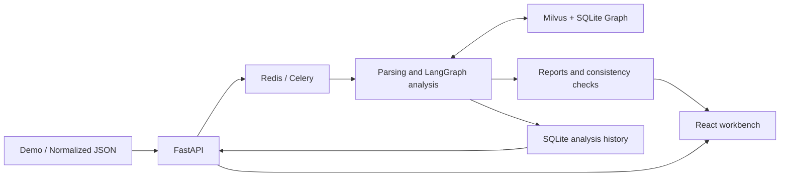

<div align="center">

# CS2 Coach Agent

**From match demos to traceable event analysis, player profiles and training suggestions**

[中文](README.md) · [Case study](docs/portfolio/CASE_STUDY.md) · [Three-minute demo](docs/portfolio/DEMO_SCRIPT.md) · [End-to-end validation](docs/FULL_FLOW_VALIDATION_V3.md)

[](https://github.com/Zzz0zzZ0/CS2-coach-agent/actions/workflows/ci.yml)
[](requirements-dev.txt)
[](frontend/package.json)
[](LICENSE)

</div>

CS2 Coach Agent is an engineering project for reviewing CS2 matches. It parses real `.dem` recordings, connects round events with evidence retrieved from historical matches, and produces reports whose claims can be checked. It also supports player comparisons, source inspection and read-only questions over saved analyses.

LangGraph orchestrates the analysis nodes. Code generates the metrics, factual reports and citations; the model selects training topics from an allowlist. The project focuses on the complete data pipeline, explainable retrieval boundaries, failure handling and reproducible evaluation.

## Capabilities

| Feature | Actual behavior |
| --- | --- |
| Match review | Upload a Demo or submit normalized Webhook JSON; choose full review, tactical comparison or player coaching |
| Factual reports | Extract kills, utility, flashes, plants and rosters; calculate scores, side performance and round conversion while preserving missing values and unknown outcomes |
| Historical retrieval | Combine Milvus dense + BM25 / RRF retrieval with a SQLite graph; cite the current match as `[C#]` and historical comparisons as `[E#]` |
| Player profiles and comparisons | Filter by map, T/CT side and opponent; show participation denominators, sample composition and associations between behavior and outcomes, with links to source rounds |
| Relation queries | Check source records for supported entities, events and temporal conditions; return found, not found within scope, insufficient information or unsupported; support bounded counts and conditional win rates |
| Read-only follow-ups | Query losses after an opening kill, post-plant losses, a specific round or a specific player; at most two steps and 20 sources per question, with no model calls |
| Execution and recovery | Show actual node events and durations; save the input hash, source commit and complete report; restore reports after refresh and deduplicate redelivery of completed tasks |

Source lists load summaries first and fetch the body on expansion. Details are pinned to the task and input version; changing context cancels pending requests. The graph uses a scrollable SVG without an additional graph visualization framework.

## Current validation results

This is the acceptance snapshot from **2026-09-09**. Full records and failure history are retained in the [validation report](docs/FULL_FLOW_VALIDATION_V3.md) and [structured results](datasets/evaluation/full_flow_v3_report.json).

| Validation scope | Result |
| --- | --- |
| Offline tests, dependency checks and frontend build | **354 tests passed**; [corresponding CI passed](https://github.com/Zzz0zzZ0/CS2-coach-agent/actions/runs/34324785193) |
| Real Demo end-to-end flows | **5 maps, 111 distinct rounds and three analysis modes** passed, including overtime |
| Input and report sources | HTTP checks passed for all 111 round sources; metrics and fixed-report consistency checks passed |
| Entry points and recovery | Webhook, invalid-file handling, refresh recovery, loss of one task's Redis cache and redelivery of a completed task passed |
| Development retrieval regression | Vector / Graph / Hybrid each **50/50** |
| Original frozen-query regression | Vector **28/30**; Graph / Hybrid each **30/30** |
| Structured and relation contracts | Tactical / player queries **30/30, 20/20**; relation expressions **48/48**; aggregation **96/96** |
| Profiles and UI | Source-event audits passed for 56 players; profile comparison, relation sources and graph reachability on desktop / mobile passed |

This run found and fixed internal round-topic queries being routed into the strict relation parser, restoring retrieval-plan coverage across the five maps from **12/17 to 17/17**. Clipped graph nodes were also fixed. Reports and failure evidence from before the fixes remain available.

The model stayed paused during this run, with **0** new remote calls. Two earlier consecutive end-to-end runs used the real cloud model and reported **2,325 tokens** in total; see the [model-path and failure record](docs/LIVE_E2E_V2.md). The two sets of results are recorded separately.

The local historical corpus snapshot contains **20 series, 49 maps, 1,019 official rounds and 56 players**, yielding **1,117 Milvus documents, 5,308 tactical silver labels and 28 community summaries**. These are verified local data volumes; raw demos, model caches and runtime databases are not distributed with the repository. [Data definitions and rebuild record](docs/HISTORICAL_DATA_REBUILD_V2.md)

## Architecture and tradeoffs



The analysis chain is `Supervisor → Tools → Router → Retrieve → Critique → Analyst → Coach → Verifier`; Demo parsing and initialization are also recorded in the timeline. The three modes select existing tasks without generating arbitrary tools or executing code.

- **Compute facts, then select topics.** `demoparser2` extracts events and Tools calculates metrics. By default, only Coach makes one `qwen3.8-flash` call when the key and budget allow it; deterministic templates still generate the final report. Auxiliary model calls are disabled by default.
- **Separate text retrieval from relation verification.** Milvus retrieves historical text; SQLite stores matches, rounds, events, players and silver-label relationships. Strict relation questions check source events instead of treating similar text as proof of a relationship. Community summaries use deterministic statistics.
- **Bound retrieval retries.** Critique combines evidence quantity, task coverage, map matching and team matching. If the score is below the threshold and tasks are missing, it retries the missing portion, with at most three retrieval rounds. A passing combined score does not guarantee coverage of every task, so per-task traces are retained.
- **Persist completed results.** SQLite records the input hash, source commit, execution events and reports. Completed tasks remain readable without the Redis result cache; automatic resumption from an interrupted stage is outside the current scope.
- **Bound cost and writes.** A cross-process budget ledger defaults to a cap of 30,000 tokens / 100 attempts. Timeouts, rejections or unknown usage pause calls. Automatic knowledge ingestion is disabled by default and also requires a high-quality source, per-match approval and a passing Verifier result.

Stack: Python 3.11, FastAPI, Celery / Redis, LangGraph, Milvus 2.6, SQLite, FastEmbed / ONNX, demoparser2 and React / Vite. HLTV collection tools use DrissionPage. The current local worker uses the `solo` pool; multi-worker throughput has not been validated here.

## Quick start

### 1. Install and start

Prepare Python 3.11, Node.js 22 and Docker Compose. You also need your own `.dem` file for a real match review.

```bash
git clone https://github.com/Zzz0zzZ0/CS2-coach-agent.git
cd CS2-coach-agent
make bootstrap
npm --prefix frontend ci
```

`make bootstrap` creates `.venv`, installs Python packages with the dependency constraints, copies the environment template only if `.env` does not exist, and starts Redis, Milvus, etcd and MinIO. See [.env.example](.env.example) for the full configuration.

For a first run, leave `DASHSCOPE_API_KEY` unset to use the rule-based Coach. To use the cloud model, configure a valid key in `.env` or through the local UI. The runtime key file takes precedence over environment configuration, and the UI never returns the key. The model entry point currently supports only `qwen3.8-flash`, with thinking disabled; a configured key does not mean the budget permits calls. View the ledger status in the UI; changing the key or restarting does not reset it. [Budget boundaries](docs/MODEL_BUDGET_BOUNDARIES.md)

The default `EMBEDDING_BACKEND=fastembed` uses local embeddings; downloading the model for the first time requires network access. `LLM_AUXILIARY_CALLS_ENABLED=false`, `AUTONOMOUS_TOOL_SELECTION_ENABLED=false` and `AUTO_INGEST_ENABLED=false` keep auxiliary calls and automatic ingestion disabled.

Terminal one:

```bash
make dev
```

Terminal two:

```bash
make frontend
```

Open the [workbench](http://localhost:5173) or [API documentation](http://127.0.0.1:8001/docs). Vite proxies `/api` to `8001`; if you change the backend port, update the [proxy configuration](frontend/vite.config.js) as well. `make dev` starts the API and worker; terminating that command stops both.

### 2. Submit a match

Select a Demo and analysis mode in the workbench, or use the API:

```bash
curl -X POST http://127.0.0.1:8001/api/upload-demo \
  -F "file=@data/sample.dem" \
  -F "analysis_mode=demo_forensic"

# Replace the placeholder with the returned task_id
curl http://127.0.0.1:8001/api/tasks/{task_id}
```

The console offers three modes: `demo_forensic`, `tactical_comparison` and `player_coaching`. The uploaded copy is cleaned up when the task ends; the original file is unchanged. For a simplified command-line analysis, use `make analyze DEMO=data/sample.dem`. That entry point bypasses Celery, does not connect to the historical Graph client and does not save task history for the UI. Use the upload entry point for the complete experience.

`POST /api/webhook/match-end` accepts generic normalized JSON; see [MatchWebhookPayload](app/domain/match_models.py) for its field contract. Data from third-party platforms must first be mapped to that format. There is currently no native FACEIT / 5E adapter.

### 3. Optional: build a historical corpus

A fresh clone does not include the historical data described above. Deterministic analysis of the current match can continue when historical retrieval is unavailable; historical profiles and comparisons require demos and indexes.

Place historical demos in `data/demos/`, inspect the document count, then build the stores:

```bash
.venv/bin/python scripts/seed_knowledge.py --dry-run
make graph-build
make seed
```

These data-building commands **rebuild the configured graph, and `make seed` replaces the `cs2_tactical_knowledge` collection by default**. Back up existing data first and use a separate graph path or new collection for experiments; see the [historical rebuild procedure](docs/HISTORICAL_DATA_REBUILD_V2.md). Running service processes may cache graph / retrieval clients. After switching data, restart the API and worker while the task queue is idle.

The collection tool can first discover matches; it downloads demos only when `--download` is explicitly added:

```bash
make fetch-demos ARGS="--days 7 --min-rating 2 --max-matches 10"
```

Downloads require a local Chromium / Chrome installation, an actual Demo link exposed on the HLTV page and a local extraction tool. Existing demos can be used directly. [Download entry point and options](scripts/fetch_recent_demos.py)

## Tests and benchmarks

### Offline validation without a key

Code-only validation requires neither Docker nor match data. Install the dependencies and run these commands from the repository root:

```bash
python3.11 -m venv .venv
.venv/bin/python -m pip install -r requirements-dev.txt -c requirements-lock.txt
.venv/bin/python -m pip check
make test
npm --prefix frontend ci
make frontend-build
```

Installation requires network access. Test execution requires no model, Redis, Milvus or embedding download. Tests isolate `.env`, use temporary SQLite databases and block Python socket networking. CI uses the same dependency constraints and frontend lockfile. [Offline validation guide](docs/OFFLINE_VALIDATION.md)

### Regression on the real corpus

With the matching historical graph, Milvus collection and local embeddings ready, write results to a new local directory:

```bash
make eval-v1 ARGS="--output data/evaluation/readme-run/development.json"
make eval-v1 ARGS="--retrieval-dataset datasets/evaluation/retrieval_queries_holdout_v1.json --output data/evaluation/readme-run/holdout.json"
```

Use a different output directory for subsequent runs to preserve earlier reports; do not rewrite frozen inputs. The exit code primarily checks production Graph / Hybrid retrieval and structured contracts. Inspect the report for Vector's two existing `intent_match` failures. Query pass rates here are engineering checks, not standard Recall@k. Combined scores also cannot fairly compare methods whose structured capabilities differ.

### Retrieval comparisons on the same corpus

The [Chinese and English baseline experiment](docs/LANGUAGE_BASELINES_V2.md) contains 768 historical development results. The [isolated-match pilot](docs/ISOLATED_RELATION_PILOT_V1.md) contains 960 text-retrieval results and 60 relation-expression checks across two previously observed series.


The chart shows development evaluation using AI-assisted labels. The dense models also differ in their effective chunk capacity. Jina achieved higher historical development nDCG@5 than MiniLM, but its advantage in the isolated pilot varied by series, and RRF did not consistently improve results. Text top-k methods without calibrated abstention still returned results for unanswerable queries. [Chart data and generation record](docs/portfolio/benchmark-figure-manifest.json)

## Known boundaries

- Verifier checks consistency among normalized input, derived metrics, current sources and fixed report templates. It shares the parsing and calculation chain, so it is not an independent factual judge; it also does not verify full semantic support from historical evidence.
- Player statistics use actual participation denominators and show sample composition and unknown values. Observed associations do not establish causality, skill rankings or training effectiveness. Match dates and comparable longitudinal samples are insufficient, so the system does not report trends.
- The regression sets and five-map pilot have already been observed. AI labels and rule-derived silver labels are not independent human gold labels. Blind quality review by human coaches is deferred, and the model's quality improvement remains unscored.
- The current deployment target is a local workbench. Authentication for public deployment, tenant isolation and load capacity are outside this acceptance scope. The model ledger accounts only for calls through this project, not the provider account's remaining quota.

## Project structure and further reading

```text
app/
├── api/routers/           # Upload, Webhook, tasks, follow-ups, graph and settings APIs
├── agentic/              # LangGraph state, nodes and execution events
├── core/                 # Configuration, providers, Celery and model budget
├── domain/               # Match and analysis-result contracts
├── services/
│   ├── parser_service.py       # Demo event and roster parsing
│   ├── metrics_service.py      # Deterministic metrics and current sources
│   ├── rag_service.py          # Milvus text retrieval and evidence filtering
│   ├── graph_rag_service.py    # Historical graph, profiles and community retrieval
│   ├── relation_query_service.py # Bounded relation parsing and source-event checks
│   ├── report_verification.py  # Report consistency checks
│   ├── analysis_runs.py        # SQLite task history and input hashes
│   ├── followup_service.py     # Read-only questions over saved matches
│   └── tasks.py                # Celery entry points, persistence and cleanup
└── scrapers/             # HLTV discovery and downloads
frontend/                 # React / Vite workbench
scripts/                  # Data-building, audit and evaluation scripts
datasets/                 # Selections, frozen queries, silver labels and shareable results
docs/                     # Implementation contracts, experiments and presentation materials
test_*.py                 # Offline regression tests
data/, output/            # Local runtime data, excluded from Git
```

| Reading goal | Documentation |
| --- | --- |
| Project presentation / job and university applications | [English case study](docs/portfolio/CASE_STUDY.md) · [Chinese application notes](docs/portfolio/APPLICATION_NOTES_ZH.md) · [Demo script](docs/portfolio/DEMO_SCRIPT.md) |
| Profiles and data definitions | [Denominators and comparisons](docs/PLAYER_PROFILE_DATA_CONTRACT.md) · [Behavior and outcomes](docs/PLAYER_BEHAVIOR_OUTCOMES.md) |
| Relation queries | [Relation and aggregation contracts](docs/RELATION_QUERY_ENGINE_V2.md) |
| Runtime reliability | [History and idempotency](docs/ANALYSIS_HISTORY_V1.md) · [Report verification and follow-ups](docs/REPORT_QUESTIONS_V1.md) · [On-demand source loading](docs/SOURCE_LOADING_V1.md) |
| Performance measurements | [Profile output equivalence and timing](docs/PLAYER_PERFORMANCE_V1.md) · [Source payload sizes and tradeoffs](docs/SOURCE_LOADING_V1.md) |
| Versions and research plans | [Implementation progress](docs/IMPLEMENTATION_PROGRESS.md) · [Roadmap](docs/PROJECT_IMPROVEMENT_ROADMAP.md) · [Formal benchmark plan](docs/BENCHMARK_PLAN.md) |

## License

[MIT](LICENSE)
